# Sales Tax Report Guide

This guide provides step-by-step instructions for accessing and using the Sales Tax Report in the admin dashboard.

## Overview

The Sales Tax Report displays comprehensive sales tax data for different locations including Manhattan Beach CC, Palos Verdes, Uncategorized, and other locations. The report provides detailed charts and KPIs for tax analysis over selected time periods, allowing users to analyze tax performance by location.

## Accessing the Sales Tax Report

### 1. Navigate to Dashboard

a. Go to the admin dashboard

**URL:** `https://coreology.staging.mgrapp.com/next/admin`

### 2. Open Reports Section

a. In the left sidebar, click **"Reports"** to open the reporting area

**URL:** `https://coreology.staging.mgrapp.com/admin/reports`

### 3. Access Sales Tax Report

The Sales Tax Report loads showing charts and KPIs for the selected period.

**URL:** `https://coreology.staging.mgrapp.com/admin/reports?t=sales_tax`

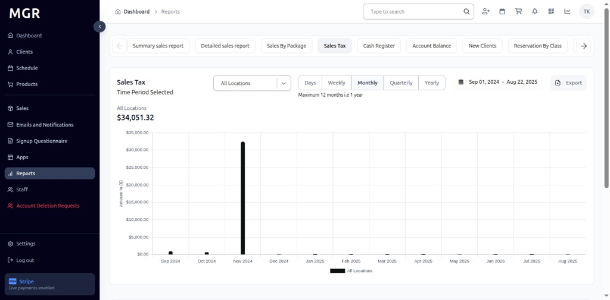

### 4. Filter by Location

By default, the report shows data for all locations. Click the **"All Locations"** dropdown beside the filter to select specific locations.

#### 4.1 Manhattan Beach CC

- Select **"Manhattan Beach CC"** from the dropdown

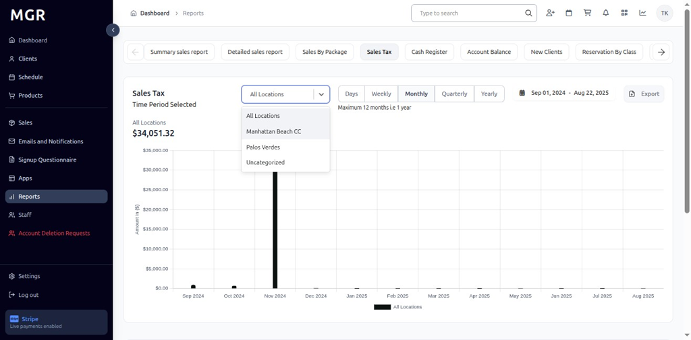

- View chart and metrics for Manhattan Beach CC tax data
- KPI updates to show Manhattan Beach CC totals for the selected period

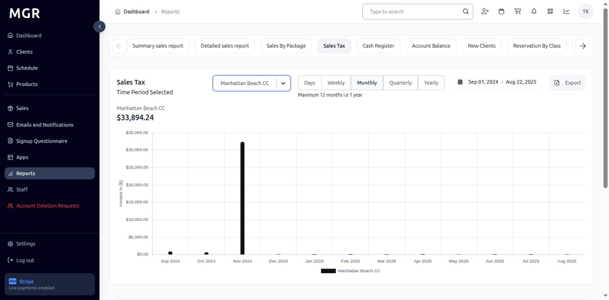

#### 4.2 Palos Verdes

- Select **"Palos Verdes"** from the dropdown

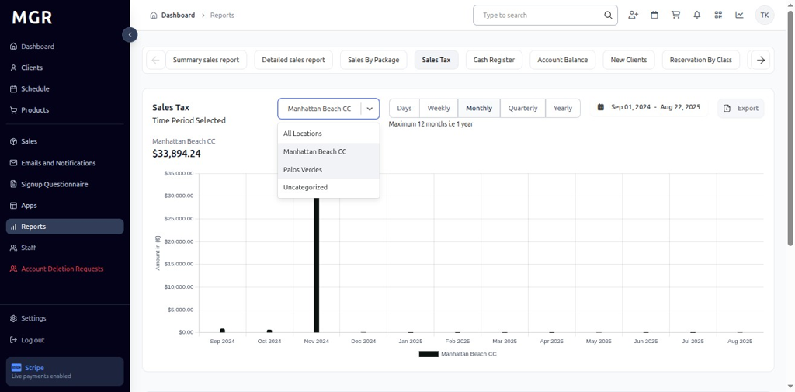

- View Palos Verdes report with KPI and bars for each period
- Chart displays Palos Verdes tax transaction trends

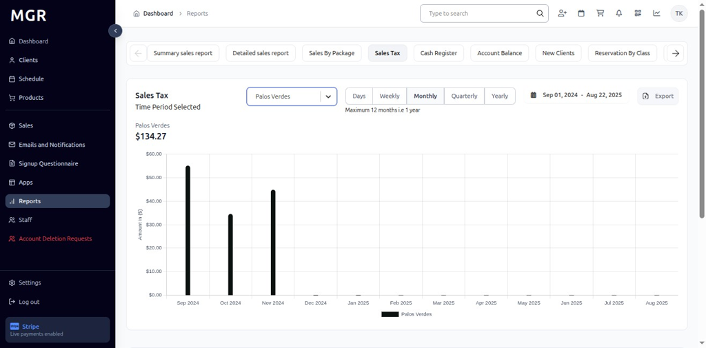

#### 4.3 Uncategorized

- Select **"Uncategorized"** from the dropdown

- Dashboard refreshes to display Uncategorized report metrics
- KPI and chart switch to Uncategorized totals for the chosen date range

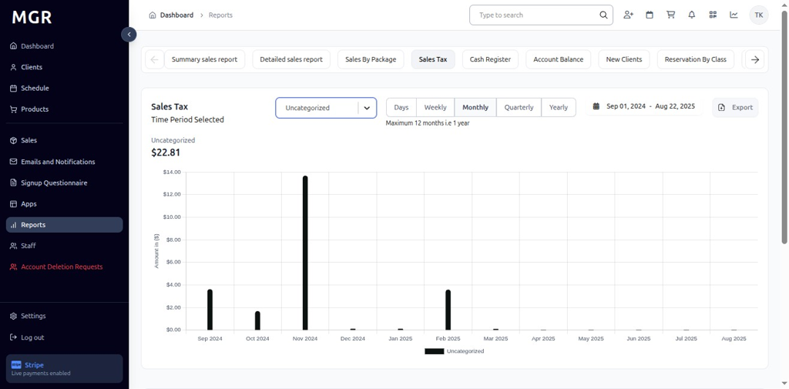

### 5. Time Period Options

#### 5.1 Daily View
- Click **"Days"** to switch to day-wise intervals
- View day-wise tax data for the selected date range
- Bars represent daily tax transaction totals

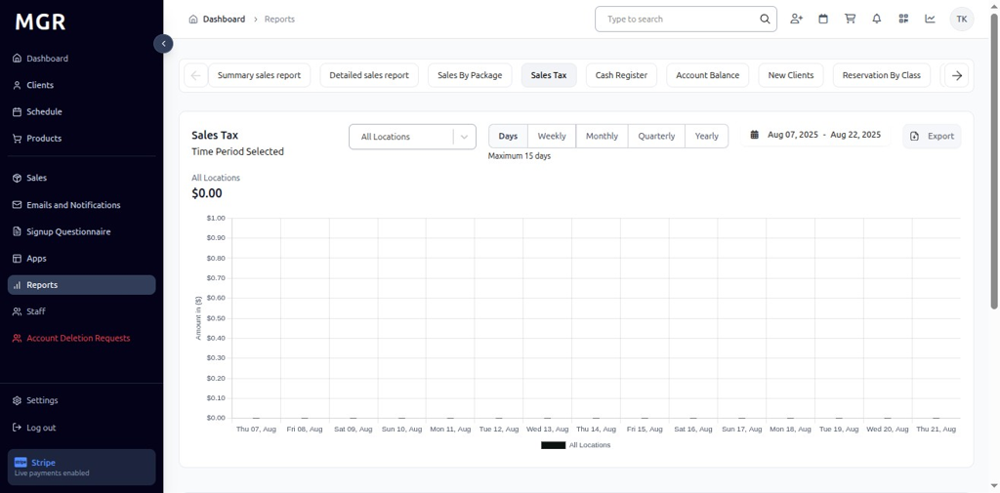

#### 5.2 Weekly View
- Click **"Weekly"** to switch to week-wise intervals
- Report displays week-wise bars and KPIs
- Data aggregated by week across the selected date range

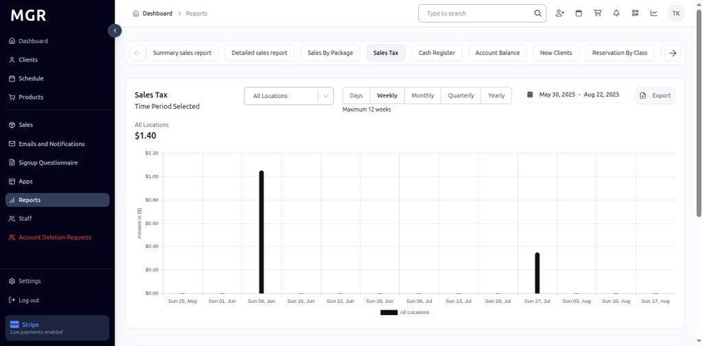

#### 5.3 Monthly View
- Click **"Monthly"** to switch to month-wise intervals
- View month-wise totals and chart representation
- Bars show monthly tax transaction summaries

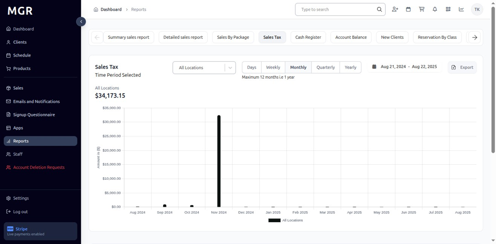

#### 5.4 Quarterly View
- Click **"Quarterly"** to switch to quarter-wise intervals
- Report aggregates data by quarter across the chosen period
- Long-term tax trend analysis becomes visible

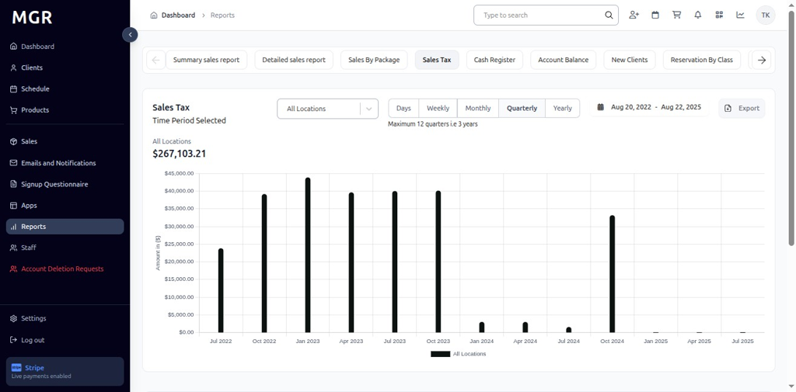

#### 5.5 Yearly View
- Click **"Yearly"** to switch to year-wise intervals
- Dashboard summarizes tax totals by year
- Provides long-range tax metrics and annual comparisons

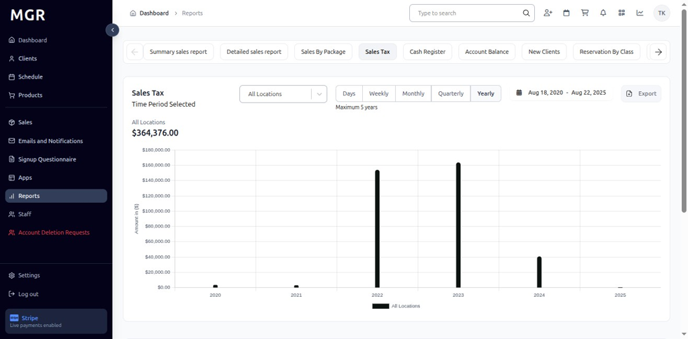

### 6. Access Export Options

Click the **"Export"** button in the top-right of the Sales Tax Report to open download options.

### 7. Export as CSV

a. Click **"Export as CSV"** from the export menu
b. File downloads in .csv format
c. Compatible with spreadsheet applications

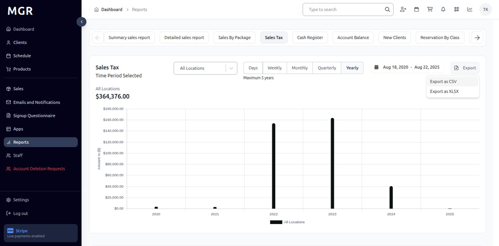

### 8. Export as Excel

a. Click **"Export as XLSX"** from the export menu
b. File downloads in Excel (.xlsx) format
c. Maintains formatting and chart data

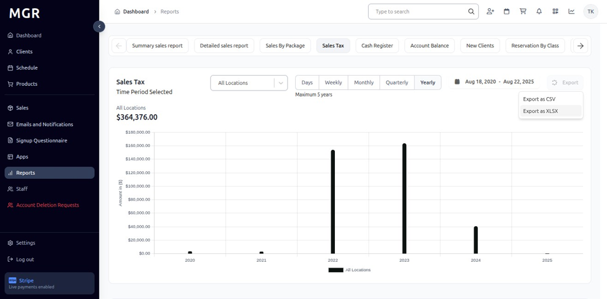

## Troubleshooting

**Common Issues:**
- **Report Not Loading:** Check internet connection and refresh the page
- **Data Not Updating:** Verify location selection and date range filters
- **Export Failures:** Ensure sufficient permissions and try smaller date ranges

**Need Help?** Contact system administrator or technical support for assistance with report access or data issues.
