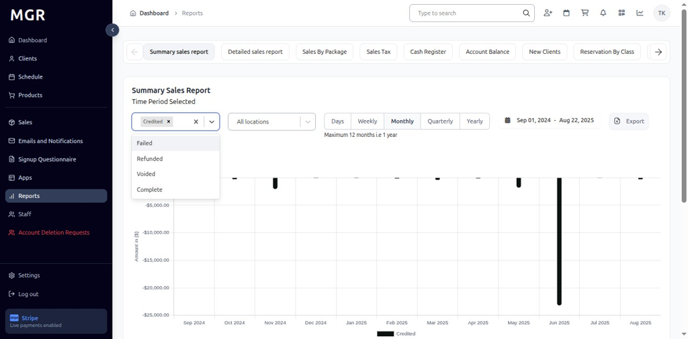
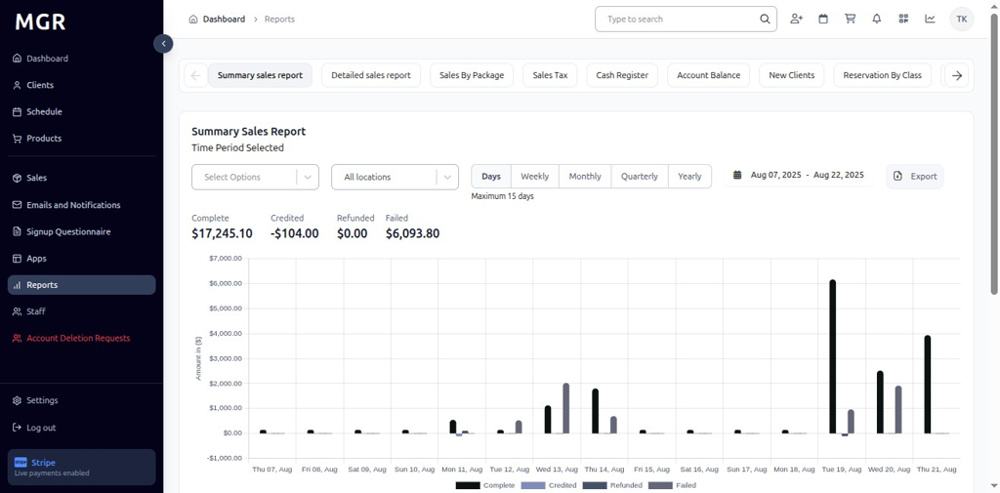

# Summary Sales Report Guide

This guide provides step-by-step instructions for accessing and using the Summary Sales Report in the admin dashboard.

## Overview

The Summary Sales Report displays comprehensive sales data including Credited, Failed, Refunded, Voided, and Complete transactions over selected time periods. The report provides both visual charts and detailed KPIs for business analysis.

## Accessing the Summary Sales Report

### 1. Navigate to Dashboard

a. Go to the admin dashboard

**URL:** `https://coreology.staging.mgrapp.com/next/admin`

### 2. Open Reports Section

a. In the left sidebar, click **"Reports"** to open the reporting area

**URL:** `https://coreology.staging.mgrapp.com/admin/reports`

### 3. Access Summary Sales Report

The Summary Sales Report loads by default when Reports is opened, showing charts and KPIs for all transaction types.

**URL:** `https://coreology.staging.mgrapp.com/admin/reports?t=summary_sales`

### 4. Select Transaction Types

Click the **"Select Options"** dropdown at the top-left of the report to filter by transaction type:

### 5. Credited Transactions
- Select **"Credited"** from the dropdown

- View chart and metrics for credited sales only
- KPI updates to show Credited totals for the selected period

### 6. Failed Transactions
- Select **"Failed"** from the dropdown

- View Failed report with KPI and bars for each period
- Chart displays failed transaction trends

### 7. Refunded Transactions
- Select **"Refunded"** from the dropdown

- Dashboard refreshes to display Refunded report metrics
- KPI and chart switch to Refunded totals

### 8. Voided Transactions
- Select **"Voided"** from the dropdown

- View updates to show Voided totals and monthly bars
- Chart displays voided transaction data

### 9. Complete Transactions
- Select **"Complete"** from the dropdown

- View Complete totals and trend analysis
- Chart and KPI switch to Complete transaction data

### 10. Filter by Location

a. Click **"All Locations"** dropdown beside the filter
b. Select the desired **Location** to scope the report to that specific site
c. Report updates to show data for the selected location only

### 11. Time Period Options

#### 11.1 Daily View
- Click **"Days"** to switch to day-wise intervals
- View Complete, Credited, Refunded, and Failed values for each day
- Bars represent daily transaction totals

#### 11.2 Weekly View
- Click **"Weekly"** to switch to week-wise intervals
- Report displays week-wise bars and KPIs
- Data aggregated by week across the selected date range

#### 11.3 Monthly View
- Click **"Monthly"** to switch to month-wise intervals
- View month-wise totals and chart representation
- Bars show monthly transaction summaries

#### 11.4 Quarterly View
- Click **"Quarterly"** to switch to quarter-wise intervals
- Report aggregates data by quarter across the chosen period
- Long-term trend analysis becomes visible

#### 11.5 Yearly View
- Click **"Yearly"** to switch to year-wise intervals
- Dashboard summarizes totals by year
- Provides long-range metrics and annual comparisons

### 12. Access Export Options

Click the **"Export"** button in the top-right of the Summary Sales Report to open download options.

### 13. Export as CSV

a. Click **"Export as CSV"** from the export menu
b. File downloads in .csv format
c. Compatible with spreadsheet applications

### 14. Export as Excel

a. Click **"Export as XLSX"** from the export menu
b. File downloads in Excel (.xlsx) format
c. Maintains formatting and chart data

## Troubleshooting

**Common Issues:**
- **Report Not Loading:** Check internet connection and refresh the page
- **Data Not Updating:** Verify date range selection and filters
- **Export Failures:** Ensure sufficient permissions and try smaller date ranges

**Need Help?** Contact system administrator or technical support for assistance with report access or data issues.
