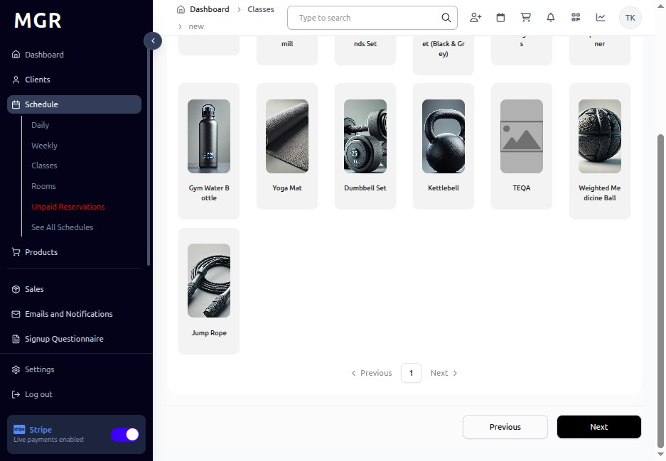

# Add New Class Guide

This guide provides step-by-step instructions for creating new classes in the Classes section within the admin dashboard.

## Steps to Add New Class

### 1. Access Admin Dashboard

a. Open your browser and navigate to the admin dashboard

**URL:** `https://coreology.staging.mgrapp.com/next/admin`

### 2. Access Classes Section

a. Click on **"Classes"** from the main navigation menu

**URL:** `https://coreology.staging.mgrapp.com/next/admin/classes`

### 3. Start Creating New Class

a. Click the **"Add New Class"** button

**URL:** `https://coreology.staging.mgrapp.com/next/admin/classes/new?initialParams=%257B%257D`

### 4. Enter Class Details

Complete the class information:

**Required Fields:**
- Class Name *
- Class Type *
- Duration *
- Description *

**Optional Fields:**
- Class Category
- Level (Beginner, Intermediate, Advanced)
- Equipment Required
- Special Notes
- Class Image

Click **"Next"** when complete.

### 5. Provide Class Requirements

Set up the requirements and prerequisites for the class:

**Requirement Settings:**
- **Prerequisites:** Previous classes or skills required
- **Age Restrictions:** Minimum/maximum age limits
- **Health Requirements:** Any health considerations or restrictions
- **Equipment Needed:** List of required equipment
- **Skill Level:** Define the appropriate skill level

Click **"Next"** to continue.

### 6. Add Linked Product for Class

a. Link relevant products or packages to this class

b. Select from available:
   - Class packages
   - Drop-in rates
   - Membership types
   - Special promotions
   - Pricing tiers

Click **"Next"** to continue.

### 7. Review Summary and Finish

a. Review all entered information:
   - Class details
   - Requirements and prerequisites
   - Linked products and pricing

b. Use **"Previous"** to make corrections if needed

c. Verify all details are correct

d. Click **"Finish"** to complete the process and create the class

The system will save the class and make it available for scheduling.

## Troubleshooting

**Common Issues:**
- **Class Name Already Exists:** Choose a unique name for the class
- **Invalid Duration:** Ensure duration is in proper format (e.g., 60 minutes)
- **Missing Required Fields:** Check all required fields are filled correctly
- **Product Linking Issues:** Verify selected products are active and available

**Validation Errors:**
- Check all required fields are completed
- Ensure class type is selected from available options
- Verify duration format is correct
- Confirm description meets minimum length requirements

**Need Help?** Contact system administrator or technical support.
