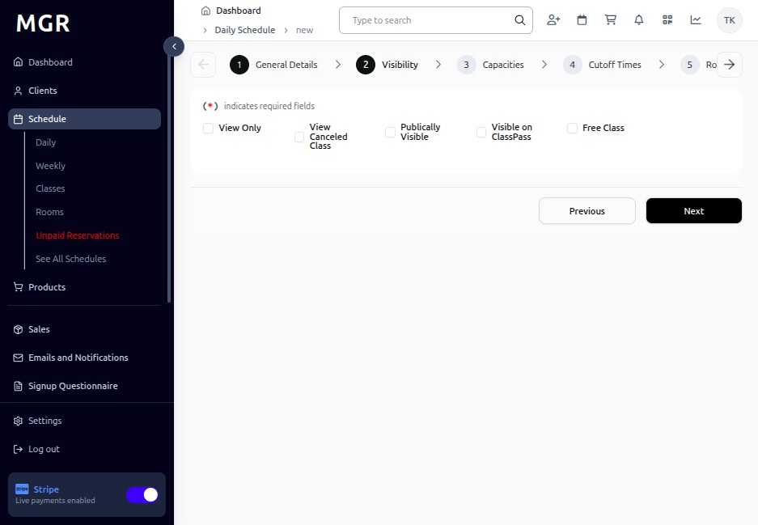

# Add New Single Class Guide

This guide provides step-by-step instructions for creating new single classes within the admin dashboard.

## Steps to Add New Single Class

### 1. Access Admin Dashboard

a. Log into the admin dashboard

b. Navigate to **Dashboard**

**URL:** `https://coreology.staging.mgrapp.com/next/admin`

### 2. Access Schedule Section

a. Click on **"Schedule"** from the main navigation

**URL:** `https://coreology.staging.mgrapp.com/next/admin/schedule`

### 3. Choose Your Calendar View (Optional)

You can create a single class from either view:

**Option A: Daily View**
- Click **"Daily"** to switch to the daily schedule view for focused day management
- This displays a single day's schedule interface

**Option B: Weekly View**  
- Click **"Weekly"** to switch to the weekly schedule view for better week visibility
- This displays the weekly schedule interface showing all days of the week

### 4. Start Adding New Single Class

a. Click **"Add New Single Class"** button

**URL:** `https://coreology.staging.mgrapp.com/next/admin/schedule/new`

### 5. Fill General Details

Complete the general information for the class:

**Required Fields:**
- Class Name *
- Date *
- Start Time *
- End Time *
- Instructor *

**Optional Fields:**
- Class Description
- Class Type
- Level
- Special Instructions

Click **"Next"** when complete.

### 6. Add Visibility Settings

Configure who can see and book this class:

**Visibility Options:**
- Public (visible to all members)
- Private (visible to specific members only)
- Staff Only
- Hidden from online booking

Click **"Next"** to continue.

### 7. Add Capacities

Set the capacity limits for the class:

**Capacity Settings:**
- **Maximum Capacity:** Total number of participants allowed
- **Waitlist Capacity:** Number of people allowed on waitlist
- **Minimum Capacity:** Minimum participants required to run class

Click **"Next"** when capacity is set.

### 8. Fill Cutoff Times

Configure booking and cancellation deadlines:

**Cutoff Time Settings:**
- **Booking Cutoff:** How long before class starts booking closes
- **Cancellation Cutoff:** Latest time members can cancel without penalty
- **Late Cancel Fee:** Fee charged for late cancellations (if applicable)

Click **"Next"** to continue.

### 9. Select Room

a. Choose the room where the class will be held

b. Available rooms will be displayed based on capacity and availability

c. Room details (capacity, equipment) will be shown for reference

Click **"Next"** when room is selected.

### 10. Add Linked Product for Class

a. Link relevant products or packages to this class

b. Select from available:
   - Class packages
   - Drop-in rates
   - Membership types
   - Special promotions

Click **"Next"** to continue.

### 11. Review Summary and Finish

a. Review all entered information:
   - General details
   - Visibility settings
   - Capacity settings
   - Cutoff times
   - Room assignment
   - Linked products

b. Use **"Previous"** to make corrections if needed

c. Verify all details are correct

d. Click **"Finish"** to complete the process and create the class

The system will save the class and add it to the schedule view.

## Troubleshooting

**Common Issues:**
- **Time Conflict:** Another class may already be scheduled at that time/room
- **Instructor Unavailable:** Check instructor schedule for conflicts
- **Room Capacity:** Ensure room capacity meets class requirements
- **Invalid Cutoff Times:** Booking cutoff must be before class start time

**Validation Errors:**
- Check all required fields are filled correctly
- Ensure date/time formats are valid
- Verify instructor and room availability

**Need Help?** Contact system administrator or technical support.
