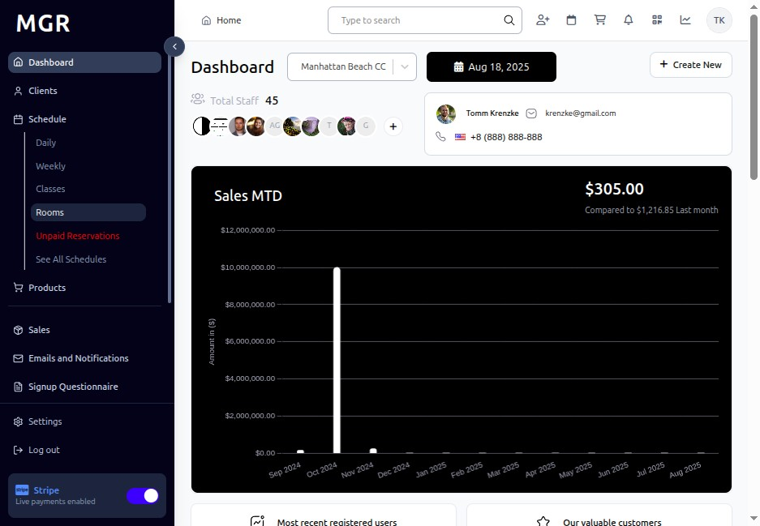

# Add New Room Guide

This guide provides step-by-step instructions for creating new rooms in the Rooms section within the admin dashboard.

## Steps to Add New Room

### 1. Access Admin Dashboard

a. Open your browser and navigate to the admin dashboard

**URL:** `https://coreology.staging.mgrapp.com/next/admin`

### 2. Access Rooms Section

a. Click on **"Rooms"** in the admin menu

**URL:** `https://coreology.staging.mgrapp.com/next/admin/rooms`

### 3. Initiate Adding New Room

a. Click the **"Add New Room"** button

**URL:** `https://coreology.staging.mgrapp.com/next/admin/rooms/new?initialParams=%257B%257D`

### 4. Enter Room General Details

Complete the general information for the room:

**Required Fields:**
- Room Name *
- Room Type *
- Maximum Capacity *
- Location *

**Optional Fields:**
- Room Description
- Special Features
- Equipment Available
- Accessibility Features
- Temperature Control
- Sound System
- Lighting Options

Click **"Next"** when complete.

### 5. Add Room Layout

Configure the room layout and specifications:

**Layout Settings:**
- **Floor Plan:** Upload or select room layout diagram
- **Dimensions:** Length, width, height specifications
- **Equipment Placement:** Fixed equipment positions
- **Entry/Exit Points:** Door locations and accessibility
- **Storage Areas:** Available storage space
- **Special Zones:** Designated areas for specific activities

Click **"Next"** to continue.

### 6. Review Summary and Finish

a. Review all entered information:
   - General room details
   - Layout and specifications
   - Equipment and features

b. Use **"Previous"** to make corrections if needed

c. Verify all details are correct

d. Click **"Finish"** to complete the process and create the room

The system will save the room and make it available for class scheduling.

## Troubleshooting

**Common Issues:**
- **Room Name Already Exists:** Choose a unique name for the room
- **Invalid Capacity:** Ensure capacity is a positive number
- **Missing Required Fields:** Check all required fields are filled correctly
- **Layout Upload Issues:** Verify image file format and size requirements

**Validation Errors:**
- Check all required fields are completed
- Ensure room type is selected from available options
- Verify capacity is within reasonable limits
- Confirm location information is accurate

**Need Help?** Contact system administrator or technical support.
