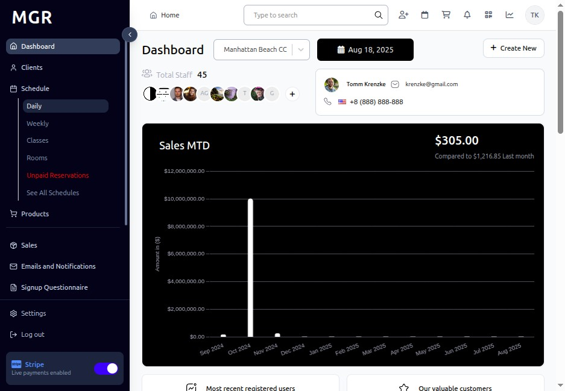

# Add New Schedule Guide

This guide provides step-by-step instructions for creating new recurring schedules in the admin dashboard.

## Steps to Add New Schedule

### 1. Access Admin Portal

a. Navigate to the admin portal

**URL:** `https://coreology.staging.mgrapp.com/next/admin`

### 2. Open Schedule Section

a. Click **"Schedule"** from the main navigation

**URL:** `https://coreology.staging.mgrapp.com/next/admin/schedule`

### 3. Switch to Daily View

a. Click **"Daily"** to access the daily schedule view

### 4. Add New Schedule

a. Click **"Add New Schedule"** to create a recurring schedule

**URL:** `https://coreology.staging.mgrapp.com/next/admin/recurrences/new`

### 5. Fill General Details

Complete the general information for the recurring schedule:

**Required Fields:**
- Schedule Name *
- Class Type *
- Start Date *
- End Date *
- Start Time *
- End Time *
- Instructor *

**Optional Fields:**
- Schedule Description
- Special Instructions
- Notes

Click **"Next"** when complete.

### 6. Add Visibility Settings

Configure who can see and book classes in this schedule:

**Visibility Options:**
- Public (visible to all members)
- Private (visible to specific members only)
- Staff Only
- Hidden from online booking

Click **"Next"** to continue.

### 7. Add Days for New Schedule

Select the days when classes will occur:

**Day Selection:**
- **Weekly Pattern:** Choose specific days of the week
- **Custom Pattern:** Set custom recurring patterns
- **Frequency:** Every week, every other week, monthly, etc.
- **Exceptions:** Mark specific dates to skip

Click **"Next"** when days are selected.

### 8. Add Capacities

Set the capacity limits for classes in this schedule:

**Capacity Settings:**
- **Maximum Capacity:** Total number of participants allowed per class
- **Waitlist Capacity:** Number of people allowed on waitlist
- **Minimum Capacity:** Minimum participants required to run each class

Click **"Next"** when capacity is set.

### 9. Fill Cutoff Times

Configure booking and cancellation deadlines:

**Cutoff Time Settings:**
- **Booking Cutoff:** How long before class starts booking closes
- **Cancellation Cutoff:** Latest time members can cancel without penalty
- **Late Cancel Fee:** Fee charged for late cancellations (if applicable)

Click **"Next"** to continue.

### 10. Select Room

a. Choose the room where classes will be held

b. Ensure room availability for all scheduled days and times

c. Room details (capacity, equipment) will be shown for reference

Click **"Next"** when room is selected.

### 11. Add Linked Product for Class

a. Link relevant products or packages to classes in this schedule

b. Select from available:
   - Class packages
   - Drop-in rates
   - Membership types
   - Special promotions

Click **"Next"** to continue.

### 12. Review Summary and Finish

a. Review all entered information:
   - General schedule details
   - Visibility settings
   - Selected days and frequency
   - Capacity settings
   - Cutoff times
   - Room assignment
   - Linked products

b. Use **"Previous"** to make corrections if needed

c. Verify all details are correct

d. Click **"Finish"** to complete the process and create the recurring schedule

The system will create all individual class instances based on your schedule settings.

## Schedule Types

### Recurring Patterns:
- **Weekly:** Same day(s) every week
- **Bi-weekly:** Every other week
- **Monthly:** Same date each month
- **Custom:** Flexible recurring patterns

### Schedule Management:
- **Bulk Changes:** Modify entire schedule at once
- **Individual Exceptions:** Edit specific class instances
- **Temporary Holds:** Pause schedule without deletion
- **Extension:** Extend end date to continue schedule

## Troubleshooting

**Common Issues:**
- **Room Conflicts:** Check room availability for all selected days
- **Instructor Conflicts:** Verify instructor availability for entire schedule period
- **Date Range Issues:** Ensure end date is after start date
- **Pattern Conflicts:** Check for overlapping schedules

**Validation Errors:**
- Check all required fields are filled correctly
- Ensure selected days have available time slots
- Verify instructor and room availability for entire period
- Confirm capacity settings are reasonable

**Schedule Creation Issues:**
- **Too Many Classes:** Large date ranges create many individual classes
- **Holiday Conflicts:** Consider holiday schedules and exceptions
- **Resource Availability:** Ensure resources available for entire schedule

**Need Help?** Contact system administrator or technical support.
