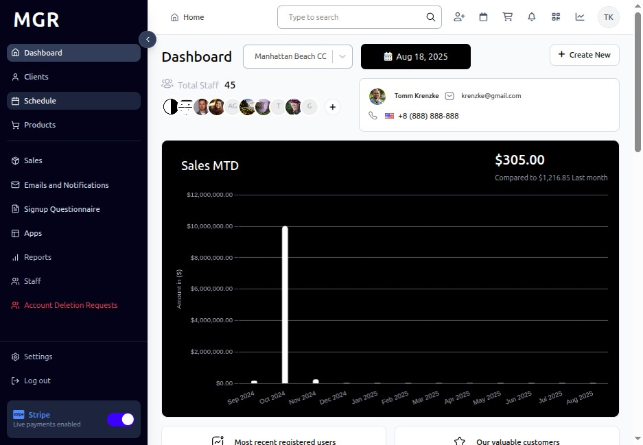
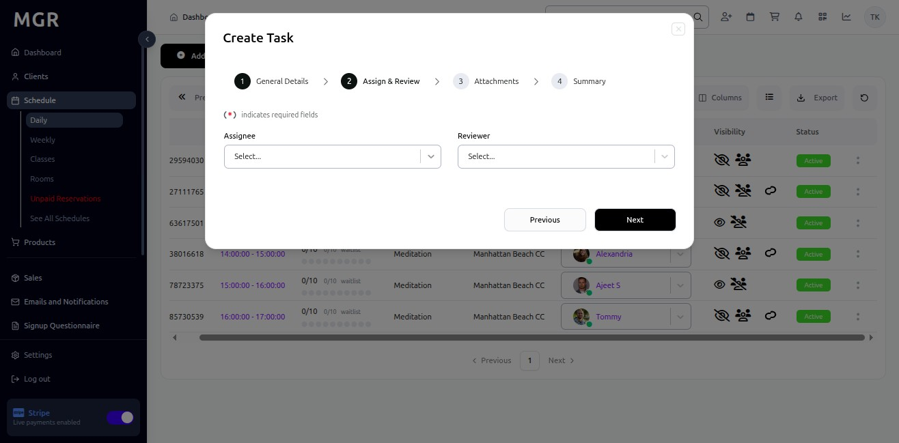

# Add Task for a Class Guide

This guide provides step-by-step instructions for adding tasks to existing classes in the Schedule section within the admin dashboard.

## Steps to Add Task for a Class

### 1. Access Admin Dashboard

Open your browser and navigate to the admin dashboard

**URL:** `https://coreology.staging.mgrapp.com/next/admin`

### 2. Access the Schedule Section

Click on **"Schedule"** in the admin menu

**URL:** `https://coreology.staging.mgrapp.com/next/admin/schedule`

### 3. Switch to Daily View

Click **"Daily"** to view the schedule in daily format

**URL:** `https://coreology.staging.mgrapp.com/next/admin/schedule`

### 4. Select Class

a. Locate the class you want to add a task to in the daily schedule view

b. Click the **three dots icon (⋮)** that reveals further actions for the selected class

### 5. Add Task

a. Click **"Add Task"** from the actions menu

b. The system will open the task creation interface

### 6. Fill the General Details

Complete the general information for the task:

**Required Fields:**
- Task Title *
- Task Description *
- Due Date *
- Assigned To *

### 7. Assign & Review the Class

a. Verify the class assignment is correct
b. Review the task details and ensure accuracy
c. Make any necessary adjustments to the task information

### 8. Add Attachments for Task

a. Click on the **"Attachments"** section
b. Upload relevant files such as:
   - Documents
   - Images
   - PDFs
   - Spreadsheets
   - Other relevant materials

c. Ensure all necessary attachments are properly uploaded

### 9. Review Summary and Finish

a. Review all entered information:
   - General task details
   - Class assignment
   - Attachments
   - Due dates and priorities

b. Use **"Previous"** to make corrections if needed

c. Verify all details are correct and complete

d. Click **"Finish"** to complete the process and create the task

## Troubleshooting

**Common Issues:**
- **Cannot Add Task:** Verify you have appropriate permissions
- **Class Not Found:** Check if the class exists and is visible in daily view
- **Attachments Not Uploading:** Verify file format and size requirements
- **Task Not Saving:** Ensure all required fields are completed

**Validation Errors:**
- Check all required fields are filled correctly
- Ensure due date is not in the past
- Verify file attachments meet size and format requirements
- Confirm class assignment is valid

**Need Help?** Contact system administrator or technical support. 