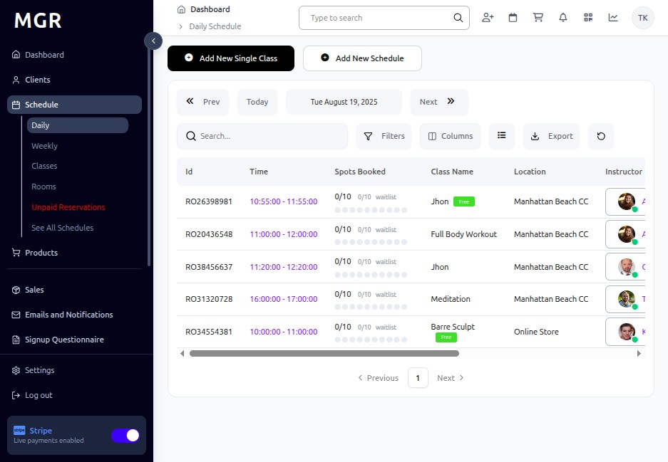
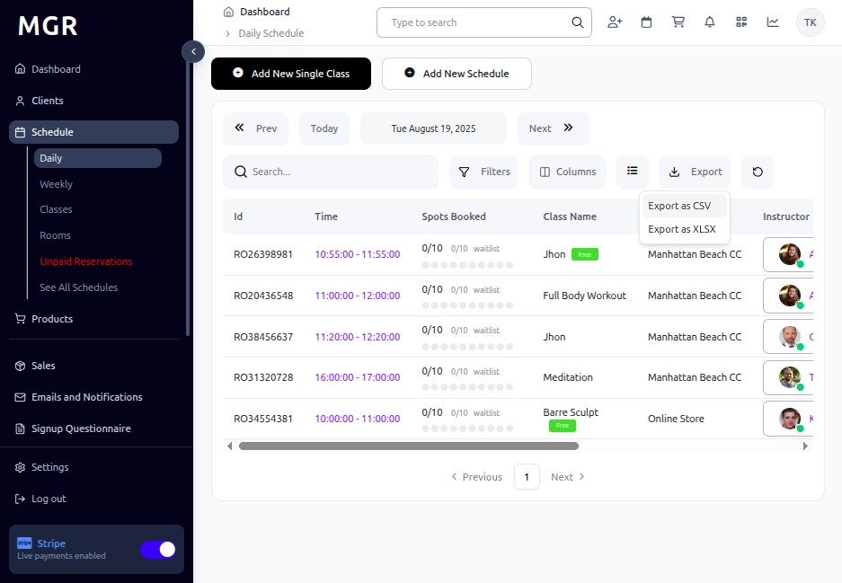

# Export Class Data Guide

This guide provides step-by-step instructions for exporting class data as CSV and XLSX files from the admin dashboard.

## Steps to Export Class Data

### 1. Access Admin Dashboard

a. Open your browser and navigate to the admin dashboard

**URL:** `https://coreology.staging.mgrapp.com/next/admin`

### 2. Switch to Daily View

a. Click the **"Daily"** tab to view the daily schedule

### 3. Open Export Options

a. Click the **"Export"** button to access export functionality

### 4. Export as CSV

a. Click **"Export as CSV"** to download class data in CSV format

b. The file will automatically download to your default download location

### 5. Alternative: Export as XLSX

a. Click **"Export"** button to open export options

b. Choose **"Export as XLSX"** to download class data in Excel format

c. The file will automatically download to your default download location

### File Formats:

**CSV Format:**
- Compatible with spreadsheet applications
- Plain text format with comma-separated values
- Smaller file size
- Easy to import into other systems

**XLSX Format:**
- Native Excel format
- Maintains formatting and structure
- Supports multiple sheets if applicable
- Better for complex data analysis

## Troubleshooting

**Common Issues:**
- **Download Not Starting:** Check browser popup blockers and download settings
- **File Access Issues:** Ensure sufficient permissions to save files
- **Large File Size:** Consider filtering date range or specific classes
- **Format Problems:** Try alternative format if one doesn't work properly

**Browser Compatibility:**
- Ensure browser allows file downloads
- Check download location settings
- Clear browser cache if issues persist
- Try different browser if problems continue

**Data Issues:**
- **Missing Data:** Verify you have appropriate permissions to view all class data
- **Incomplete Export:** Check if date filters are applied that might limit results
- **Formatting Problems:** XLSX format typically preserves formatting better than CSV

**Need Help?** Contact system administrator or technical support.
