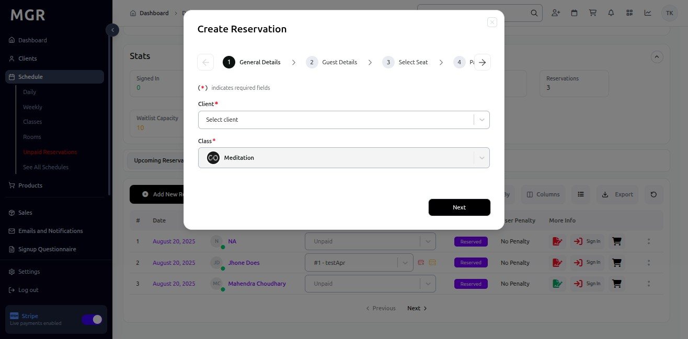

# Manage Class Guide

This guide provides comprehensive step-by-step instructions for managing classes in the Schedule section within the admin dashboard, including reservations, activity tracking, attendance, and administrative functions.

## Steps to Manage a Class

### 1. Access Admin Dashboard

Open your browser and navigate to the admin dashboard

**URL:** `https://coreology.staging.mgrapp.com/next/admin`

### 2. Switch to Daily View

Click the **"Daily"** tab to view the schedule in daily format

### 3. Open Class for Management

a. Click on **one class** to open it for detailed management

b. This will open the class management interface with all available options

## 4. Add New Reservation

Click **"Add New Reservation"** to create a new reservation for the class

### 4.1. Fill General Details

Fill in the general reservation details:
   - Customer information
   - Reservation type
   - Special requirements
   - Contact details

### 4.2. Add Guest Details

Enter guest information:
   - Guest name
   - Contact information
   - Special accommodations
   - Dietary restrictions (if applicable)

### 4.3. Select Seat

Choose the appropriate seat for the guest:
   - Available seating options
   - Seat preferences
   - Accessibility considerations
   - Group seating arrangements

### 4.4. Enter Payment Details and Finish

a. Complete payment information:
   - Payment method
   - Package selection
   - Discounts or promotions
   - Billing details

b. Click **"Finish"** to complete the reservation

## 5. View Class Activity

a. Click on **"Activity"** to view the class activity log

b. This displays all activities and changes related to the class

## 6. Change Package

### 6.1. Select Package

a. Click on the **dropdown in package columns**

b. Select the appropriate **"Package"** for the reservation

### 6.2. Confirm Package Change

a. Review the package change details

b. Click **"Confirm"** to apply the "Change Package"

## 7. Cancel Reservation

Click **"Cancel Reservation"** to cancel an existing reservation

### 7.1. Confirm Cancel Reservation Request

a. Review the cancellation details

b. Click **"Confirm"** to proceed with the cancellation

## 8. User Sign-in Management

### 8.1. Sign-in User

a. Click **"Sign-in"** to mark a user as present for the class

b. This records the user's attendance at the start of the class

### 8.2. Confirm Sign-in

a. Review the sign-in details

b. Click **"Confirm"** to complete the sign-in process

### 8.3. Sign-out User

a. Click **"Sign-out"** to mark a user as leaving the class

b. This records the user's departure time

### 8.4. Confirm Sign-out

a. Review the sign-out details

b. Click **"Confirm"** to complete the sign-out process

## 9. Cancellation Management

### 9.1. Mark Early Cancelled

a. Click **"Mark Early Cancelled"** for cancellations made before the class

b. This applies early cancellation policies and refunds

### 9.2. Confirm Early Cancellation

a. Review the early cancellation details

b. Click **"Confirm"** to apply the early cancellation

### 9.3. Mark Late Cancelled

a. Click **"Mark Late Cancelled"** for cancellations made after the class has started

b. This applies late cancellation policies

### 9.4. Confirm Late Cancellation

a. Review the late cancellation details

b. Click **"Confirm"** to apply the late cancellation

## 10. Financial Management

### 10.1. View Charges

a. Click **"Charges"** to view all financial charges related to the class

b. This displays billing information and payment status

### 10.2. Review Charges

a. Review the detailed charges:
   - Class fees
   - Additional services
   - Late fees
   - Payment history

  

## 11. Attendance Tracking

### 11.1. Mark Attended

a. Click **"Mark Attended"** to record that a user attended the class

b. This confirms participation and may affect billing

### 11.2. Confirm Attendance

a. Review the attendance details

b. Click **"Confirm"** to mark the user as attended

### 11.3. Mark No-Show

a. Click **"Mark No-Show"** for users who didn't attend despite having a reservation

b. This may trigger no-show policies and charges

### 11.4. Confirm No-Show

a. Review the no-show details

b. Click **"Confirm"** to mark the user as a no-show

## Troubleshooting

**Common Issues:**
- **Cannot Add Reservation:** Check class capacity and availability
- **Sign-in/Sign-out Not Working:** Verify user permissions and class status
- **Package Changes Not Saving:** Ensure all required fields are completed
- **Attendance Not Recording:** Check if class is in progress or completed

**Validation Errors:**
- Verify all required information is provided
- Check if actions are allowed for the current class status
- Ensure user permissions are sufficient for the requested action
- Confirm class is active and manageable

**Need Help?** Contact system administrator or technical support. 