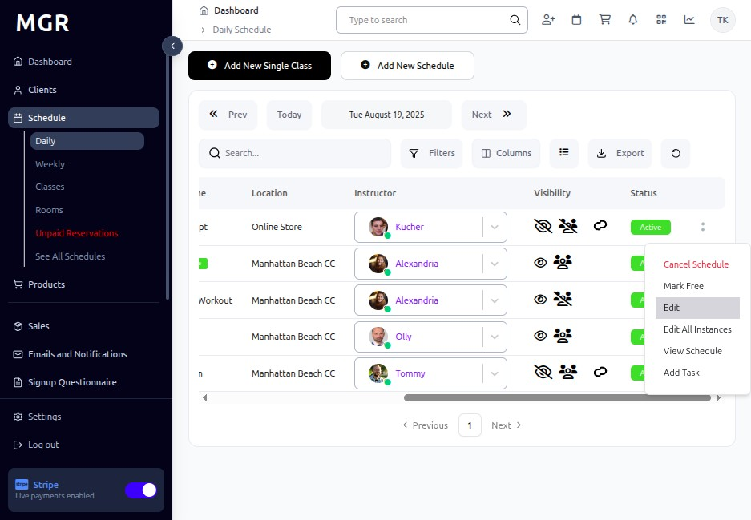
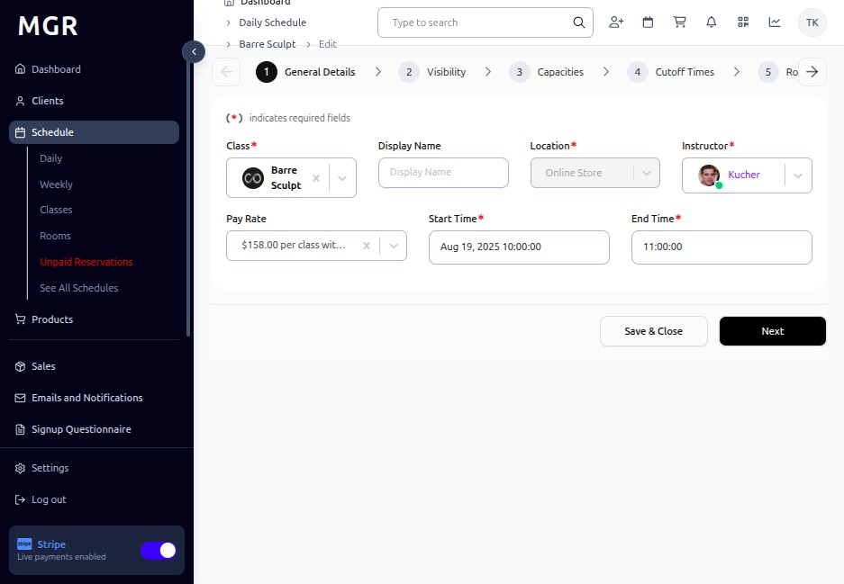
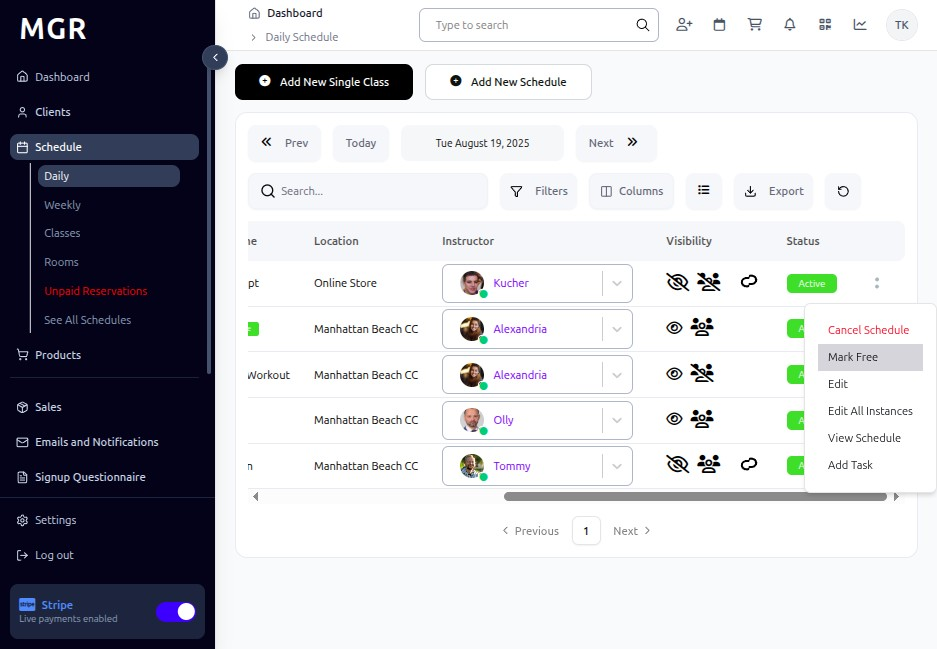
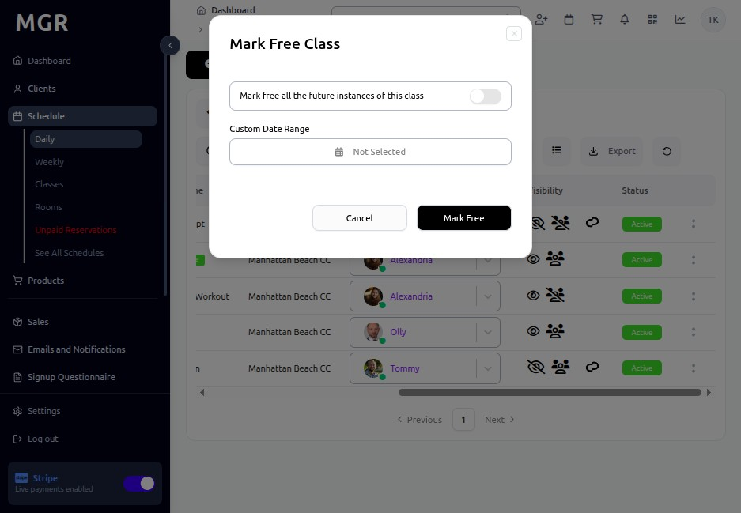
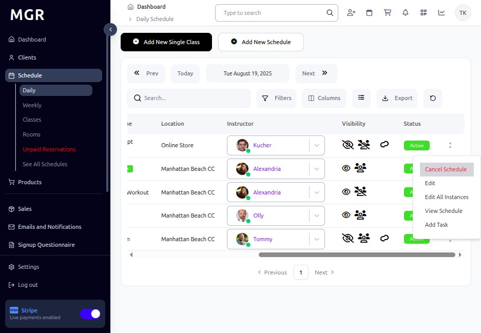
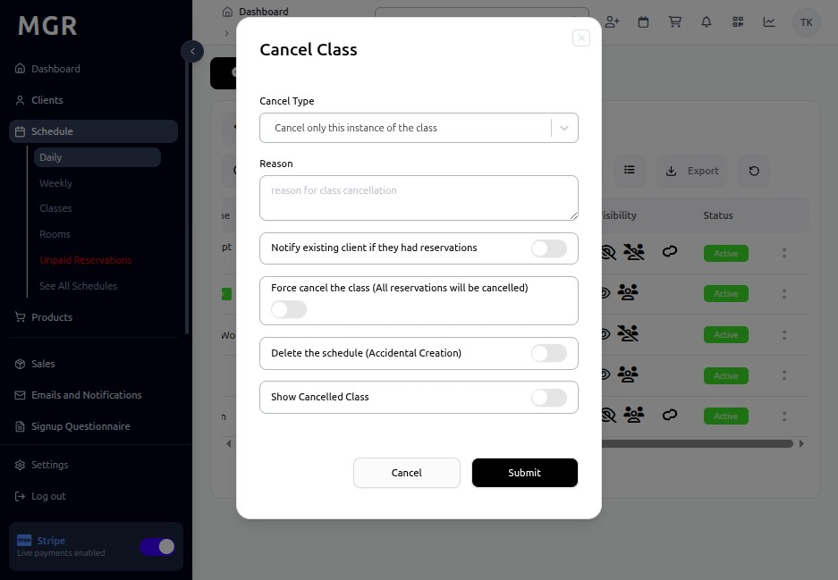

# Manage Existing Classes Guide

This guide provides step-by-step instructions for managing and modifying existing classes in the admin dashboard.

## Steps to Manage Existing Classes

### 1. Access Admin Dashboard

a. Navigate to the admin dashboard

**URL:** `https://coreology.staging.mgrapp.com/next/admin`

### 2. Switch to Daily View

a. Click the **"Daily"** tab to view the daily schedule

### 3. Open Relevant Schedule Entry

a. Locate the class you want to modify in the schedule

b. Click the designated button to access the class details

### 4. Edit Class Details

a. Click the icon that reveals further actions (usually represented by three dots)

b. Click **"Edit"** to modify the class information

c. Make necessary changes to:
   - Class time
   - Instructor
   - Room assignment
   - Capacity
   - Description
   - Other class details

### 5. Save and Close Edit Screen

a. Click **"Save & Close"** to apply any preliminary edits

b. This saves your changes and returns to the class detail view

### 6. Mark Class as Free

a. Click the icon that reveals further actions (usually represented by three dots)

b. Select **"Mark Free"** to indicate that the class will be offered at no charge

c. Click **"Mark Free"** once more to confirm the action

### 7. Cancel Schedule

If you need to cancel the class altogether:

a. Click the icon that reveals further actions (usually represented by three dots)

b. Click **"Cancel Schedule"** from the additional options menu

c. Click **"Submit"** to confirm the cancellation

## Troubleshooting

**Common Issues:**
- **Save Conflicts:** Another user may be editing the same class
- **Time Conflicts:** New time may conflict with other scheduled classes
- **Instructor Unavailable:** Check instructor availability for new times
- **Room Conflicts:** Verify room availability for schedule changes

**Validation Errors:**
- **Past Classes:** Cannot edit classes that have already occurred
- **Booked Classes:** Classes with existing bookings may have restrictions
- **Required Fields:** Ensure all required fields remain filled

**Cancellation Issues:**
- **Member Notifications:** System should automatically notify enrolled members
- **Refund Processing:** Check if automatic refunds are processed
- **Waitlist Management:** Waitlisted members may need manual handling

**Need Help?** Contact system administrator or technical support.