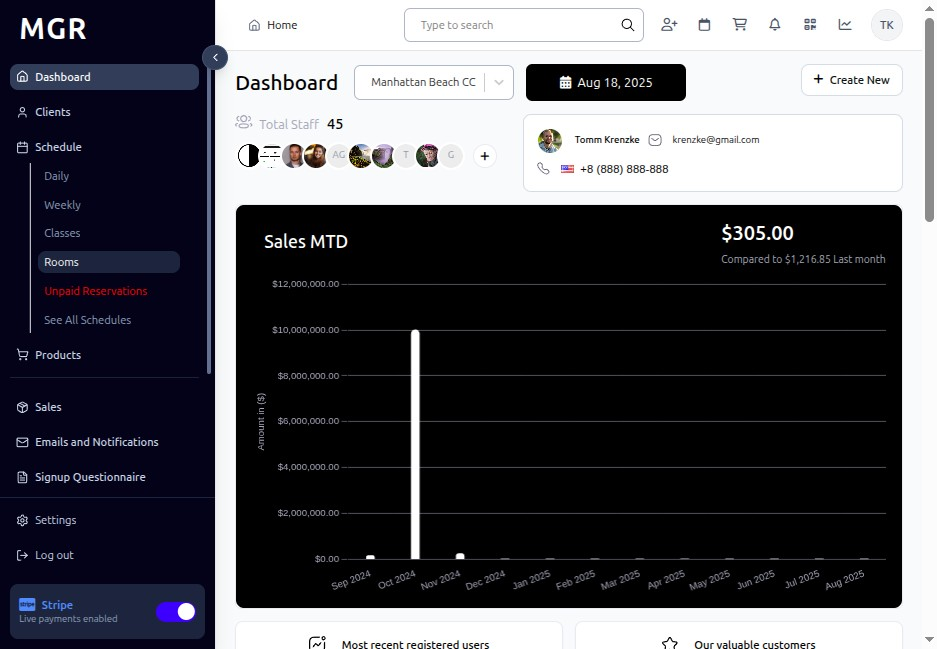
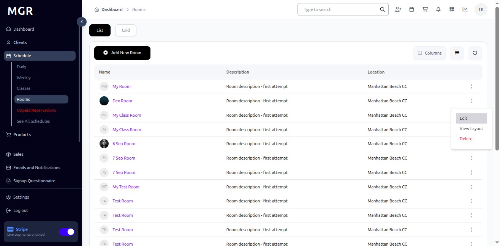
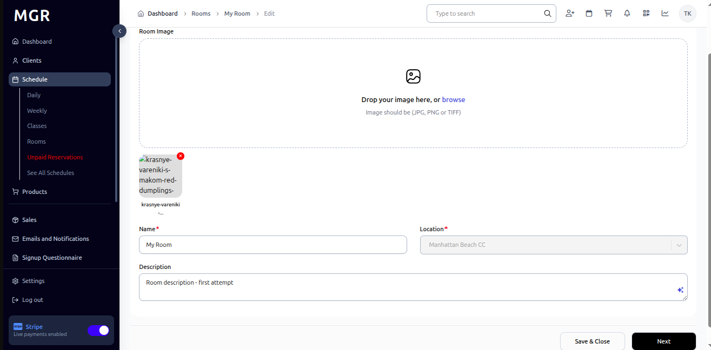
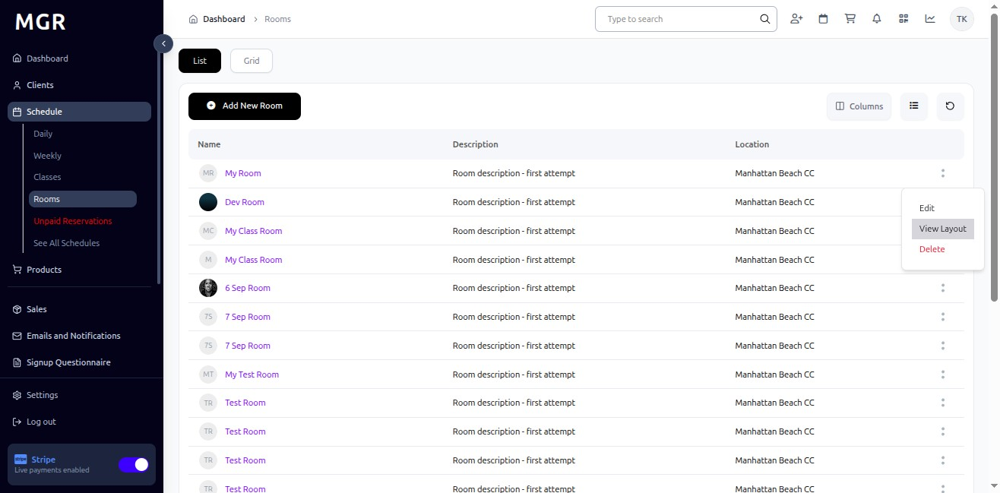
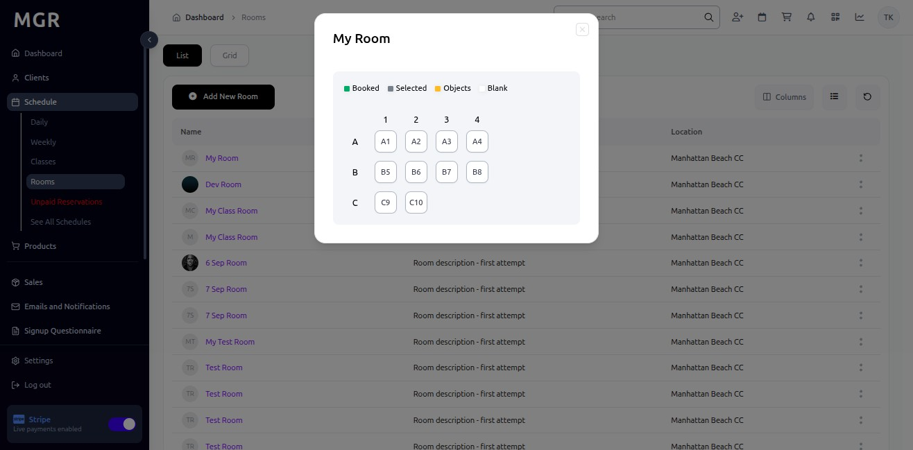
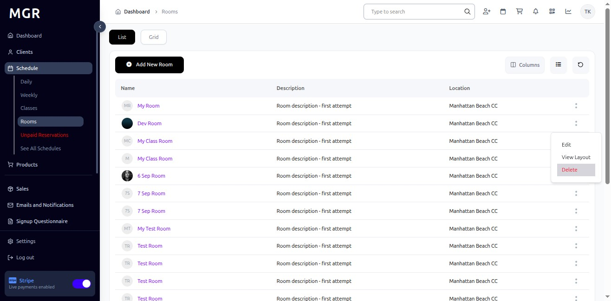
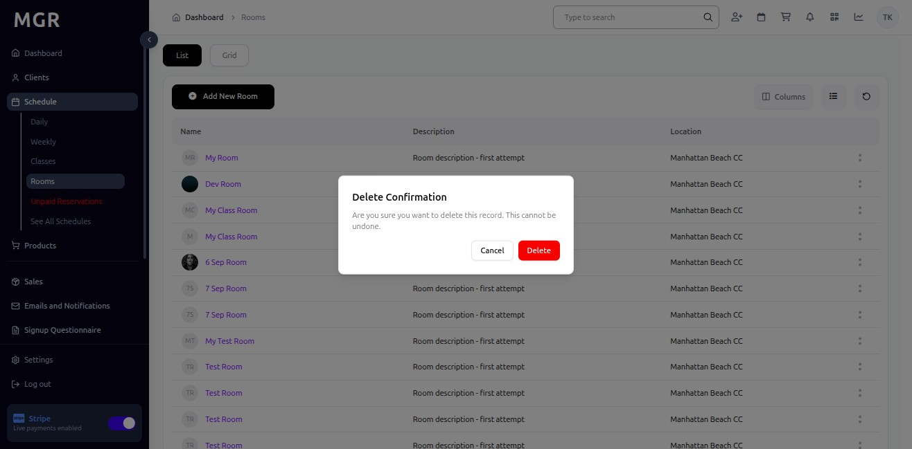

# Manage Existing Rooms Guide

This guide provides step-by-step instructions for managing existing rooms in the Rooms section within the admin dashboard, including editing, viewing layouts, and deleting rooms.

## Steps to Manage Existing Rooms

### 1. Access Admin Dashboard

Open your browser and navigate to the admin dashboard

**URL:** `https://coreology.staging.mgrapp.com/next/admin`

### 2. Access Rooms Section

Click on **"Rooms"** in the admin menu

**URL:** `https://coreology.staging.mgrapp.com/next/admin/rooms`

### 3. Select Room for Management

a. Locate the room you want to manage in the rooms list

b. Click the **three dots icon (⋮)** that reveals further actions for the selected room

### 4. Edit Room Details

a. Click on **"Edit"** from the actions menu

**URL:** `https://coreology.staging.mgrapp.com/admin/rooms/524a876f-06d2-4af7-83eb-674a84f64dcc/edit`

b. Modify the room information as needed:
   - Room Name
   - Room Type
   - Maximum Capacity
   - Location
   - Room Description
   - Room Image

c. Click **"Save & Close"** to apply the changes and return to the rooms list

### 5. View Room Layout

a. From the room actions menu, click on **"View Layout"**

b. The system will display the Room Layout showing:
   - Floor plan diagram
   - Equipment placement
   - Entry/exit points
   - Room dimensions

### 6. Delete Room

a. From the room actions menu, click on **"Delete"**

b. A confirmation dialog will appear asking you to confirm the delete request

c. Click **"Delete"** button to confirm and permanently remove the room, or click **"Cancel"** to abort the deletion

## Troubleshooting

**Common Issues:**
- **Cannot Edit Room:** Verify you have appropriate permissions
- **Layout Not Displaying:** Check if layout file is properly uploaded
- **Delete Option Unavailable:** Room may have active schedules or bookings
- **Changes Not Saving:** Ensure all required fields are completed

**Validation Errors:**
- Check all required fields are filled correctly
- Ensure room capacity is within reasonable limits
- Verify room type selection is valid
- Confirm location information is accurate

**Need Help?** Contact system administrator or technical support. 