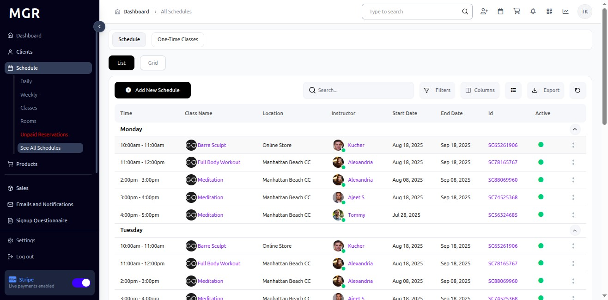
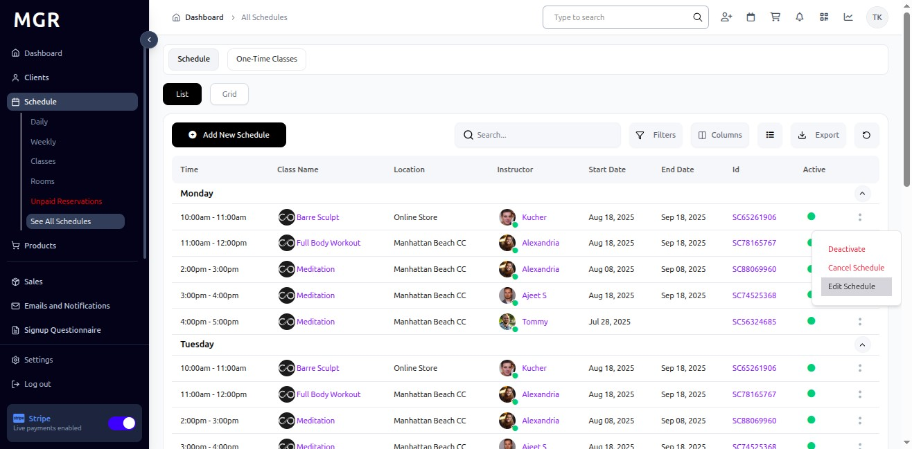
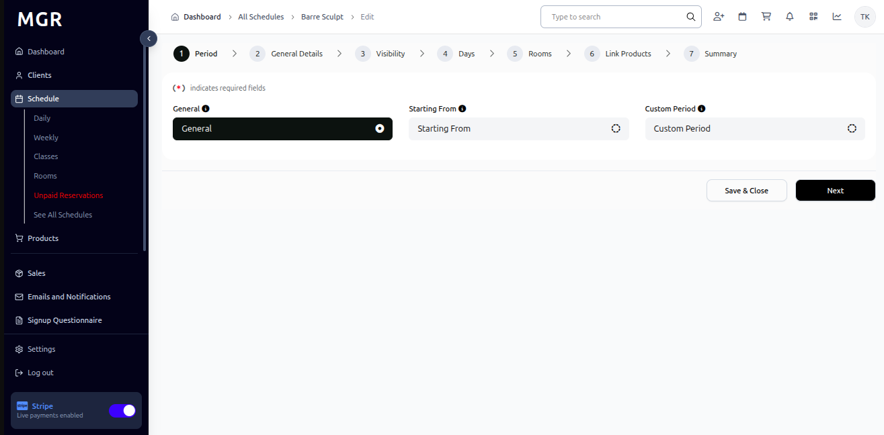
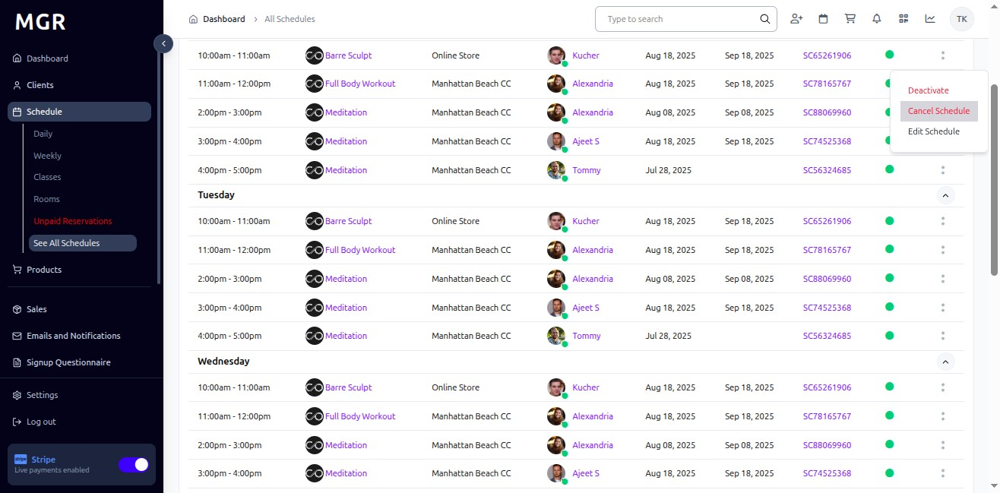
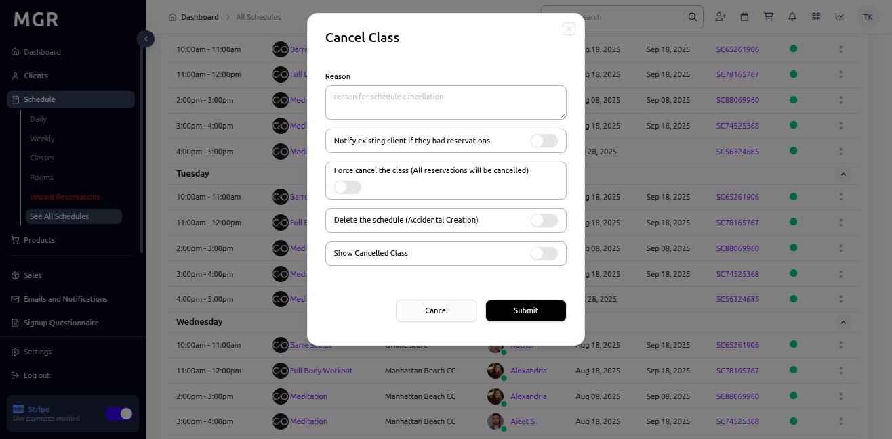
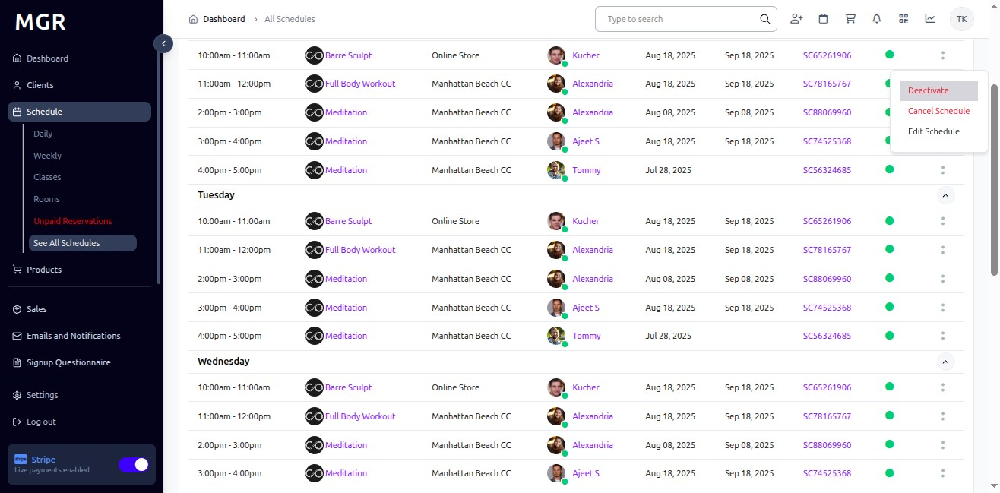
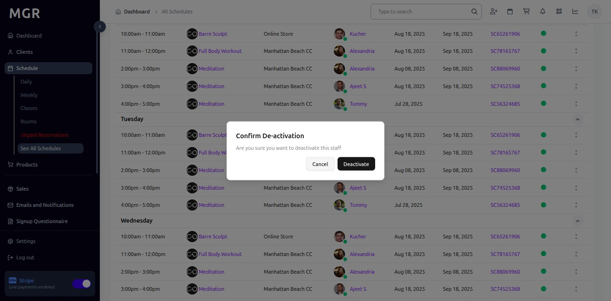

# Manage Existing Schedules Guide

This guide provides step-by-step instructions for managing existing schedules in the Schedule section within the admin dashboard, including editing, canceling, and deactivating schedules.

## Steps to Manage Existing Schedules

### 1. Access Admin Dashboard

Open your browser and navigate to the admin dashboard

**URL:** `https://coreology.staging.mgrapp.com/next/admin`

### 2. Access the Schedule Section

Click on **"Schedule"** in the admin menu

**URL:** `https://coreology.staging.mgrapp.com/next/admin/schedule`

### 3. Switch to "See All Schedules"

Click on **"See All Schedules"** to view the complete list of schedules

**URL:** `https://coreology.staging.mgrapp.com/admin/recurrences`

### 4. Select Schedule for Management

a. Locate the schedule you want to manage in the schedules list

b. Click the **three dots icon (⋮)** that reveals further actions for the selected schedule

### 5. Edit Schedule

a. Click **"Edit Schedule"** from the actions menu

**URL:** `https://coreology.staging.mgrapp.com/admin/recurrences/30a3881e-6873-4857-ab36-c06ac98cef35/edit?redirectionUrl=%2Fadmin%2Frecurrences`

b. Modify the schedule information as needed:
   - Class details
   - Time and date
   - Room assignment
   - Instructor
   - Capacity settings
   - Recurrence patterns

c. Click **"Save & Close"** to apply the changes and return to the schedules list

### 6. Cancel Schedule

a. From the schedule actions menu, click on **"Cancel Schedule"**

b. A confirmation dialog will appear asking you to confirm the cancellation

c. Click **"Submit"** button to confirm and cancel the schedule, or click **"Cancel"** to abort the cancellation request

### 7. Deactivate Schedule

a. From the schedule actions menu, click on **"Deactivate"**

b. A confirmation dialog will appear asking you to confirm the deactivation

c. Click **"Submit"** to confirm and deactivate the schedule, or click **"Cancel"** to abort the deactivation request

## Troubleshooting

**Common Issues:**
- **Cannot Edit Schedule:** Verify you have appropriate permissions
- **Schedule Not Found:** Check if it has been deleted or deactivated
- **Cancel Option Unavailable:** Schedule may be in progress or already completed
- **Deactivate Option Unavailable:** Schedule may have active registrations

**Validation Errors:**
- Check all required fields are completed
- Ensure time conflicts don't exist with other schedules
- Verify room availability for the selected time
- Confirm instructor availability

**Need Help?** Contact system administrator or technical support. 