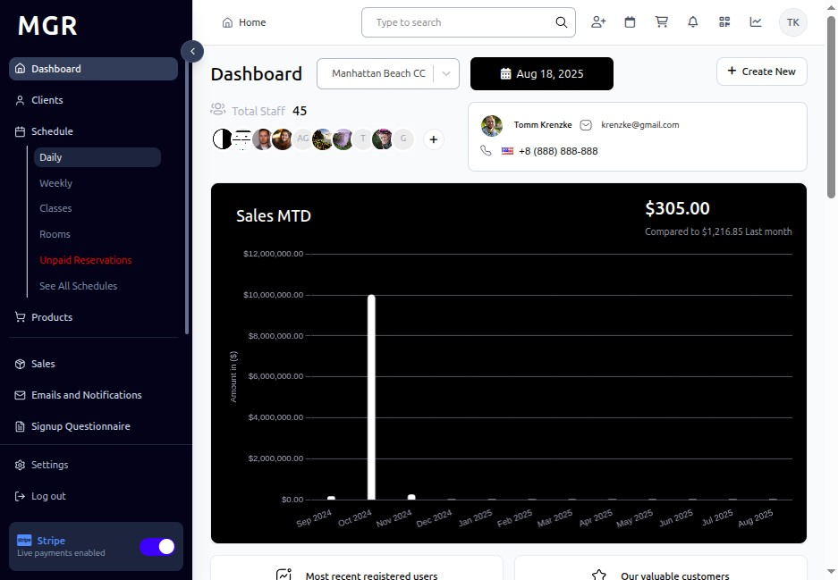
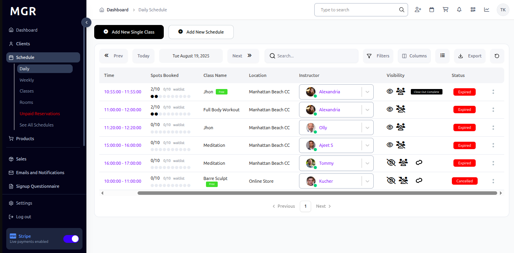
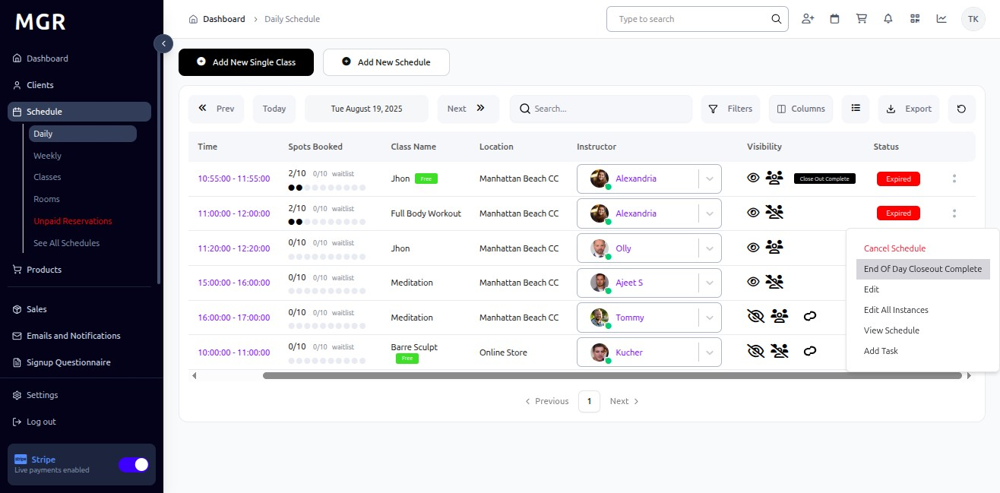
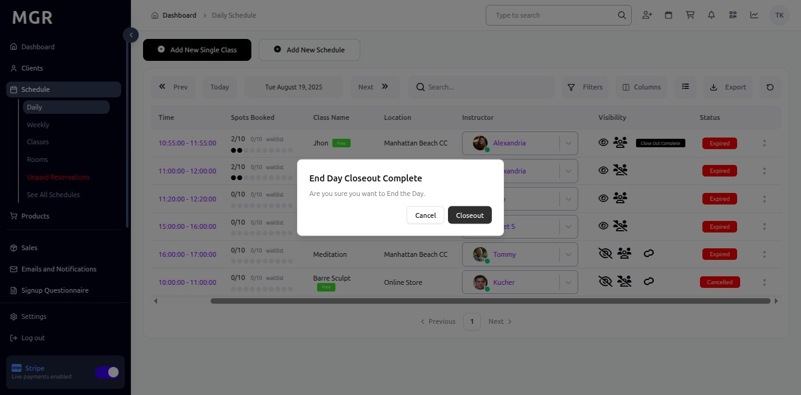

# Mark Class as "End of Day Closeout" Guide

This guide provides step-by-step instructions for marking classes in the past as "End of Day Closeout" in the Schedule section within the admin dashboard.

## Steps to Mark Class as End of Day Closeout

### 1. Access Admin Dashboard

Open your browser and navigate to the admin dashboard

**URL:** `https://coreology.staging.mgrapp.com/next/admin`

### 2. Access the Schedule Section

Click on **"Schedule"** in the admin menu

### 3. Switch to Daily View

Click **"Daily"** to view the schedule in daily format

**URL:** `https://coreology.staging.mgrapp.com/next/admin/schedule`

### 4. Go to Previous Date

a. Navigate to the previous date where the class you want to mark is located

b. Use the date navigation controls to go back to the desired date

### 5. Click on "End Of Day Closeout Complete"

a. Locate the class you want to mark as end of day closeout

b. Click on the **"End Of Day Closeout Complete"** option for that class

c. This will initiate the closeout process

### 6. Confirm the Closeout

a. A confirmation dialog will appear asking you to confirm the end of day closeout

b. Review the closeout details:
   - Class information
   - Date and time
   - Closeout status

c. Click **"Confirm"** to complete the end of day closeout process

## Troubleshooting

**Common Issues:**
- **Cannot Mark Closeout:** Verify you have appropriate permissions
- **Class Not Found:** Check if the class exists on the selected date
- **Closeout Not Saving:** Ensure all required fields are completed
- **Date Navigation Issues:** Verify the date selection is correct

**Validation Errors:**
- Check if the class is eligible for closeout
- Ensure the class date is in the past
- Verify the class status allows for closeout
- Confirm all required closeout criteria are met

**Need Help?** Contact system administrator or technical support. 