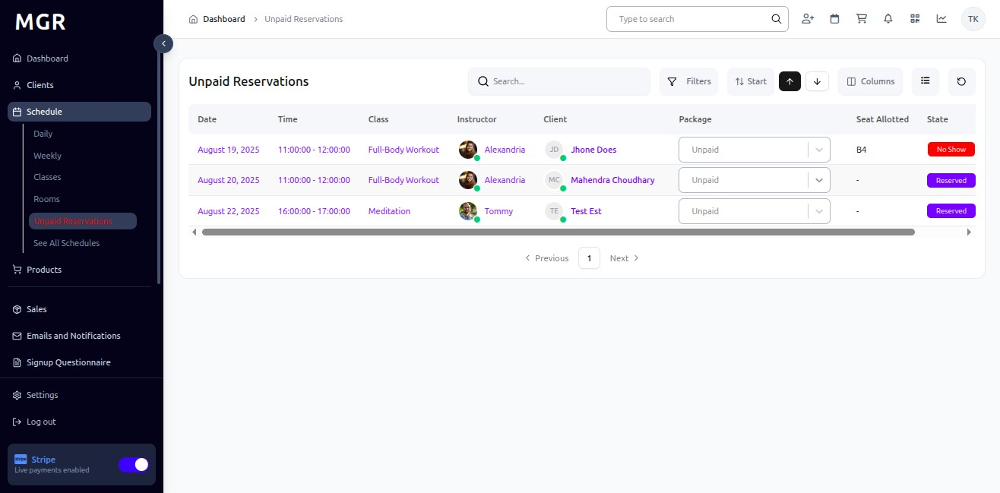
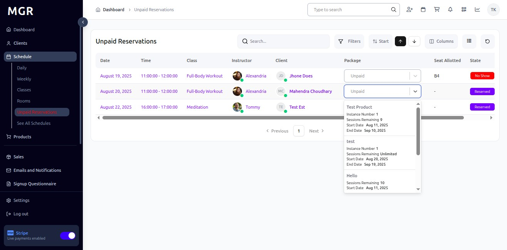
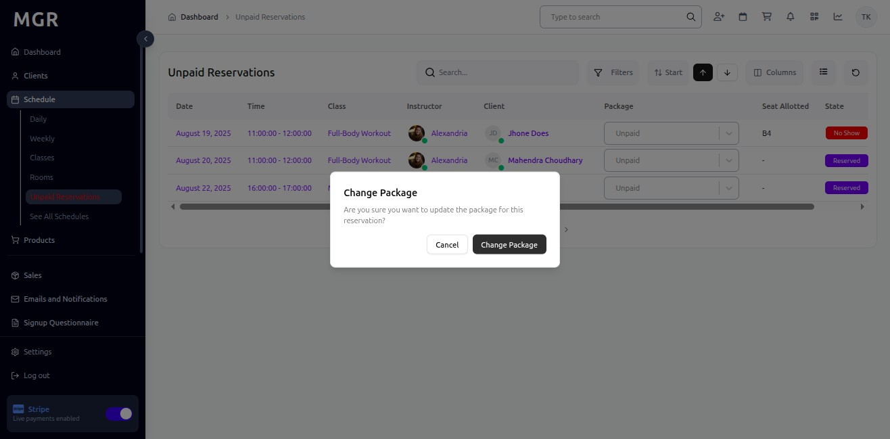

# Mark Reservation as Paid Guide

This guide provides step-by-step instructions for marking reservations as paid in the Schedule section within the admin dashboard.

## Steps to Mark Reservation as Paid

### 1. Access Admin Dashboard

Open your browser and navigate to the admin dashboard

**URL:** `https://coreology.staging.mgrapp.com/next/admin`

### 2. Access the Schedule Section

Click on **"Schedule"** in the admin menu

**URL:** `https://coreology.staging.mgrapp.com/next/admin/schedule`

### 3. Switch to "Unpaid Reservation"

a. Navigate to the **"Unpaid Reservation"** section or view

b. This will display all reservations that have not been marked as paid

### 4. Click on Dropdown in Package Column

a. Locate the reservation you want to mark as paid

b. Find the **Package** column for that reservation

c. Click on the **dropdown arrow** in the package column to reveal available options

### 5. Select the Package

a. From the dropdown menu, select the appropriate **package** for the reservation

b. Choose the package that matches the reservation type and payment amount

c. Ensure the selected package is correct for the reservation

### 6. Confirm the "Change Package"

a. A confirmation dialog will appear asking you to confirm the package change

b. Review the package change details:
   - Reservation information
   - Selected package
   - Payment amount
   - Package details

c. Click **"Confirm"** to apply the package change and mark the reservation as paid

## Troubleshooting

**Common Issues:**
- **Cannot Change Package:** Verify you have appropriate permissions
- **Package Not Available:** Check package availability and restrictions
- **Change Not Saving:** Ensure all required fields are completed
- **Reservation Not Found:** Verify the reservation exists and is visible

**Validation Errors:**
- Check if the selected package is valid for the reservation
- Ensure the package is available for the reservation dates
- Verify the reservation is eligible for package changes
- Confirm all required package criteria are met

**Need Help?** Contact system administrator or technical support. 