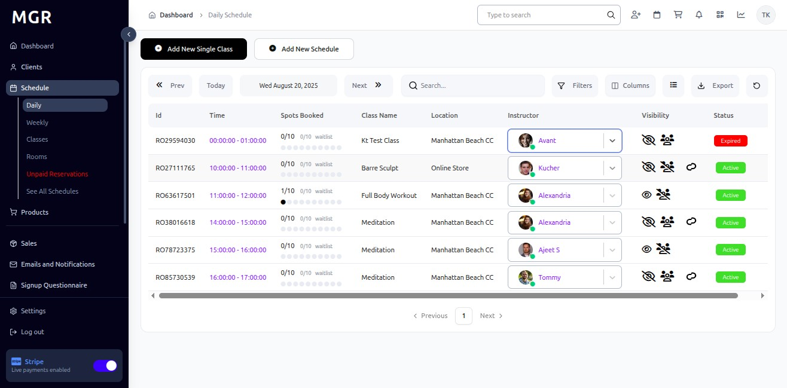
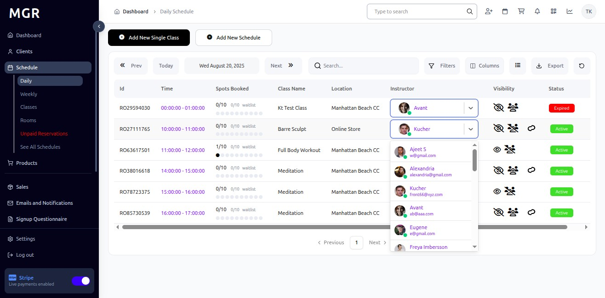
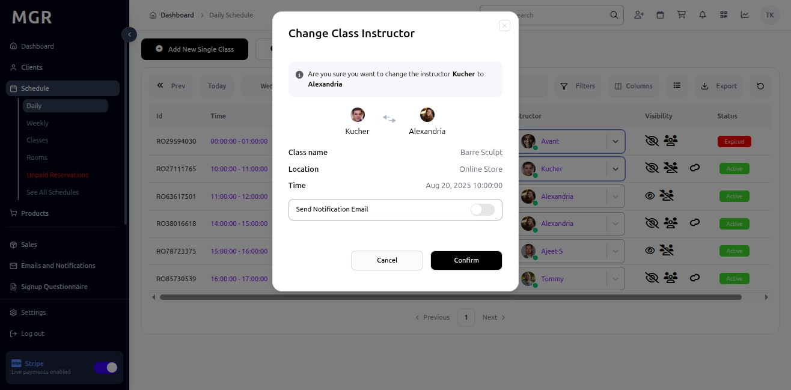

# Substitute Instructor Guide

This guide provides step-by-step instructions for substituting instructors for existing classes in the Schedule section within the admin dashboard.

## Steps to Substitute an Instructor

### 1. Access Admin Dashboard

Open your browser and navigate to the admin dashboard

**URL:** `https://coreology.staging.mgrapp.com/next/admin`

### 2. Access the Schedule Section

Click on **"Schedule"** in the admin menu

**URL:** `https://coreology.staging.mgrapp.com/next/admin/schedule`

### 3. Switch to Daily View

Click **"Daily"** to view the schedule in daily format

**URL:** `https://coreology.staging.mgrapp.com/next/admin/schedule`

### 4. Select Class

a. Locate the class you want to substitute an instructor for in the daily schedule view

b. Identify the class that needs an instructor change

### 5. Click on Instructor

a. Click on the **"Instructor"** field of the respective class

b. This will open the instructor selection interface

### 6. Select Substitute Instructor

a. From the available instructor list, select the substitute instructor for the class

b. Ensure the substitute instructor is available and qualified for the class type

c. Verify the substitute instructor's schedule doesn't conflict with other classes

### 7. Confirm Change Class Instructor

a. Review the instructor change details:
   - Original instructor
   - New substitute instructor
   - Class details and time
   - Date of substitution

b. Click **"Confirm"** to apply the instructor change

c. The system will update the class with the new instructor assignment

## Troubleshooting

**Common Issues:**
- **Cannot Change Instructor:** Verify you have appropriate permissions
- **Substitute Not Available:** Check instructor availability and schedule conflicts
- **Change Not Saving:** Ensure all required fields are completed
- **Instructor Not Found:** Verify the substitute instructor exists in the system

**Validation Errors:**
- Check if the substitute instructor is qualified for the class type
- Ensure no schedule conflicts exist
- Verify the instructor change is within allowed timeframes
- Confirm the class is not already in progress

**Need Help?** Contact system administrator or technical support. 