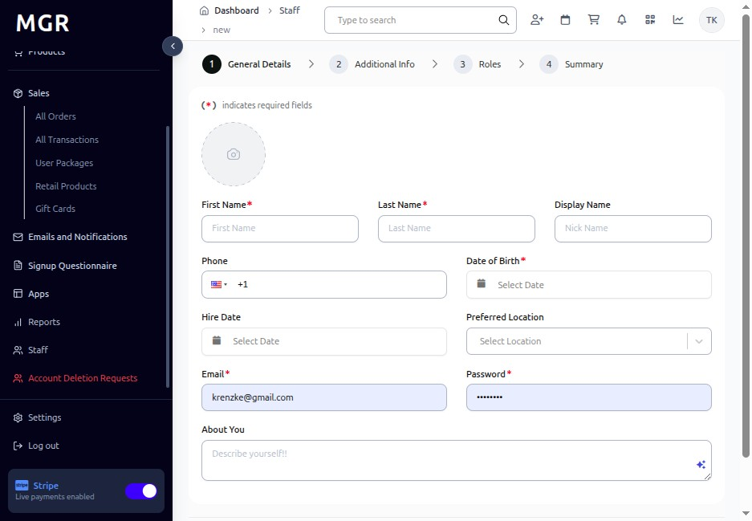
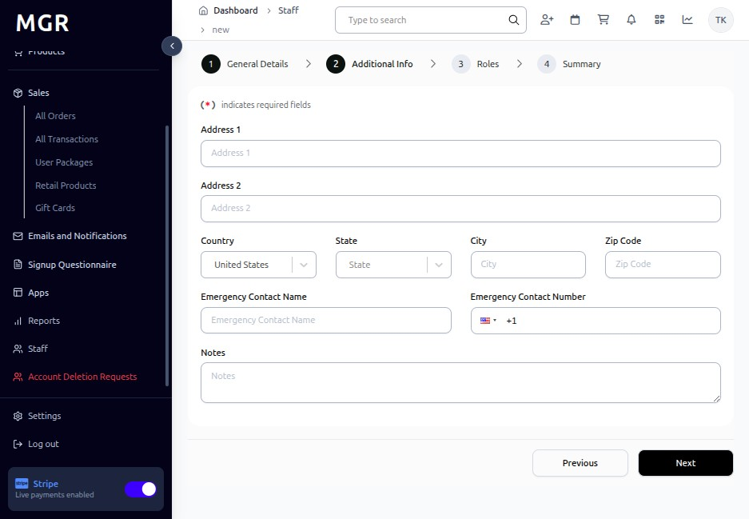
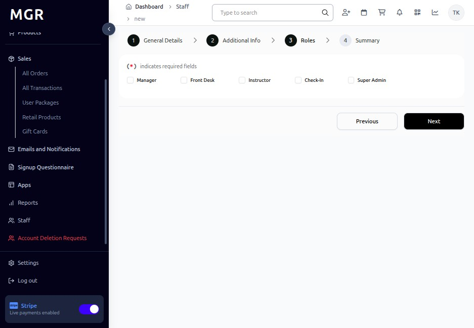
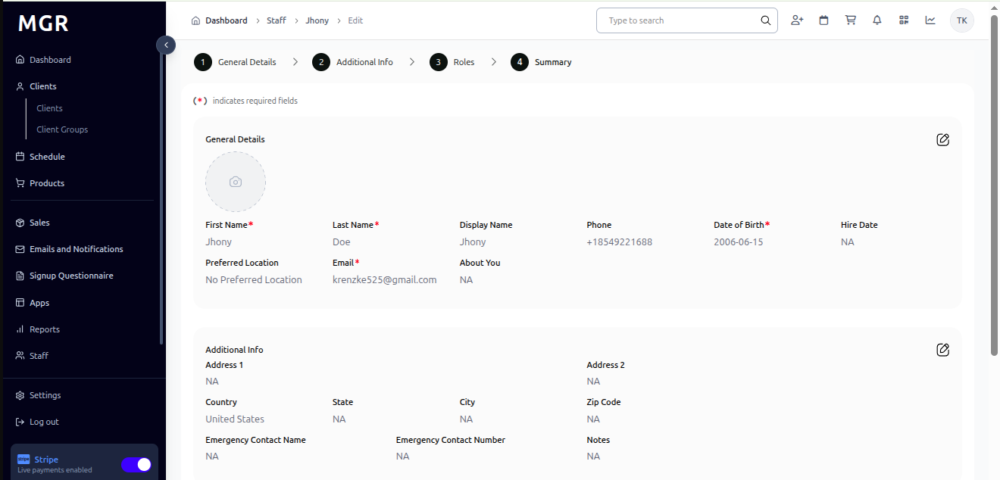

# Add New Staff Guide

This guide provides step-by-step instructions for creating new staff accounts in the admin dashboard.

## Steps to Add New Staff

### 1. Access Staff Module

a. Log into the admin dashboard

b. Navigate to **Dashboard → Staff**

c. Click **"Add New Staff"** button

**URL:** `https://coreology.staging.mgrapp.com/next/admin/staff`

### 2. Enter General Details

Fill in the required information (* = required):

**Required Fields:**
- First Name *
- Last Name *
- Email *
- Date of Birth *

**Optional Fields:**
- Display Name
- Phone
- Hire Date
- Preferred Location
- About You

Click **"Next"** when complete.

### 3. Add Additional Information

Complete any relevant fields:

**Available Fields:**
- **Address Information:**
  - Address 1
  - Address 2
  - Country (defaults to United States)
  - State
  - City
  - Zip Code
- **Emergency Contact:**
  - Emergency Contact Name
  - Emergency Contact Number
- **Additional Information:**
  - Notes

Click **"Next"** to continue.

### 4. Assign Roles

Select appropriate roles for the staff member:

- Manager
- Front Desk
- Instructor
- Check-In
- Super Admin

Click **"Next"** when roles are selected.

### 5. Summary

a. Review all entered information

b. Check role assignments

c. Use **"Previous"** to make corrections if needed

d. Click **"Finish"** to create the staff profile

The system will save the record and redirect to the staff detail page.

## Troubleshooting

**Common Issues:**
- **Email Already Exists:** Staff member may already have an account
- **Validation Errors:** Check all required fields are filled correctly
- **Role Problems:** Verify role availability and permissions

**Need Help?** Contact system administrator or technical support.
