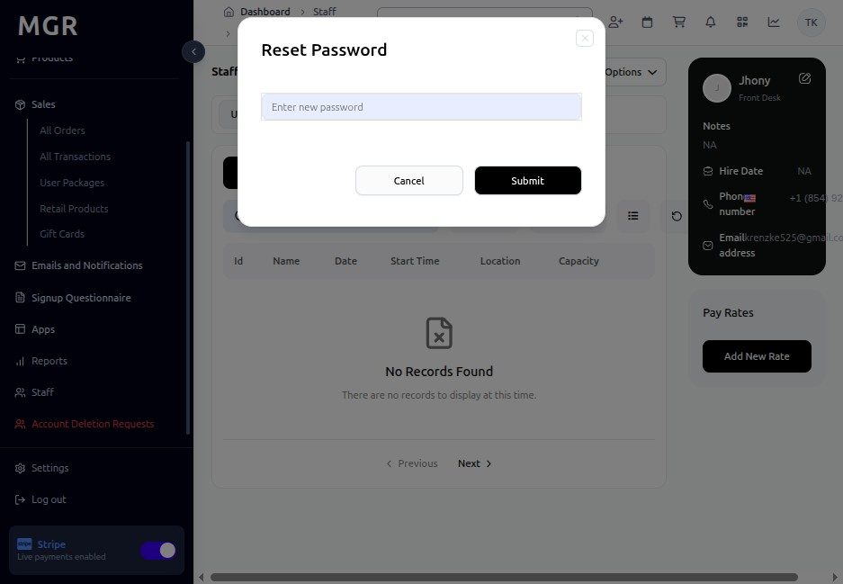

# Manage Existing Staff Guide

Simple step-by-step instructions for managing existing staff members in the admin dashboard.

## Steps to Manage Existing Staff

### 1. Access Staff Module

a. Log into the admin dashboard

b. Navigate to **Dashboard → Staff**

c. View the complete list of staff members

**URL:** `https://coreology.staging.mgrapp.com/next/admin/staff`

### 2. Edit Staff Profile

a. Navigate to the staff member's detail page

b. Click on the **"Options"** button

c. Select **"Edit"** from the dropdown menu

d. Update the required information across all tabs

e. Save changes to apply updates

**URL Example:** `https://coreology.staging.mgrapp.com/next/admin/staff/jhon-doe/edit`

**Editable Sections:**
- Personal and contact information
- Role assignments
- Employment details
- Additional custom fields

### 3. Reset Password

a. Navigate to the staff member's detail page

b. Click on the **"Options"** button (⋮)

c. Select **"Reset Password"** from the dropdown menu

d. Confirm the password reset action

e. The system will send reset instructions

## Troubleshooting

**Common Issues:**
- **Password Reset Failures:** Check email delivery and system notifications
- **Edit Permission Issues:** Verify admin has sufficient permissions to modify staff profiles
- **Data Validation Errors:** Ensure all updated fields meet system requirements

**Need Help?** Contact system administrator or technical support. 