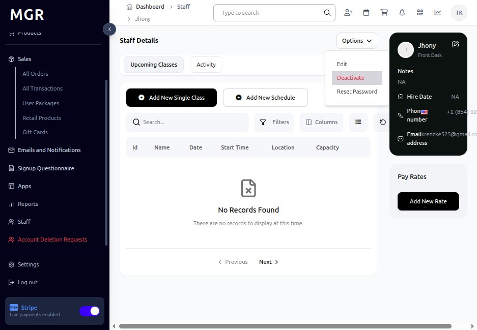

# Staff Account Status Management

Simple step-by-step instructions for managing staff account status in the admin dashboard.

## Steps to Manage Staff Account Status

### 1. Access Staff Detail Page

a. Navigate to **Dashboard → Staff**

b. Search for and select the staff member

c. Click on their name to open the detail page

**URL:** `https://coreology.staging.mgrapp.com/next/admin/staff/jhon-doe`

### 2. Deactivate Staff Account

a. Locate the **"Options"** button on the staff detail page

b. Click to open the dropdown menu

c. Choose **"Deactivate"** from the dropdown menu

d. Review the deactivation warning message

e. Click **"Confirm"** or **"Deactivate"** to proceed

**Effects of Deactivation:**
- User cannot sign in to the system
- All historical records remain intact
- Previous work assignments and history are preserved
- Account shows as "Inactive" in staff lists

### 3. Activate Staff Account

a. Click on the staff member's name to open their detail page

b. Locate the **"Options"** button on the staff detail page

c. Click to open the dropdown menu

d. Choose **"Activate"** from the dropdown menu

e. Review the Activation warning message

f. Click **"Activate"** to proceed

**Effects of Activation:**
- User can sign in to the system again
- Previous roles and permissions are restored
- User regains access to their assigned data and functions
- Account shows as "Active" in staff lists

## Troubleshooting

**Deactivation Problems:**
- **Cannot find deactivate option:** Verify administrative permissions
- **Deactivation fails:** Check for active system sessions or pending tasks
- **Status not updating:** Refresh browser and verify database connection

**Activation Problems:**
- **Cannot activate account:** Verify account hasn't been permanently deleted
- **User still cannot login:** Check for additional account locks or expired passwords
- **Permissions missing after activation:** Verify role assignments weren't modified

**Resolution Steps:**
1. Verify administrator has staff management rights
2. Check system connectivity and maintenance status
3. Review system logs for error messages
4. Contact support with specific issue details and screenshots

**Need Help?** Contact system administrator or technical support.
