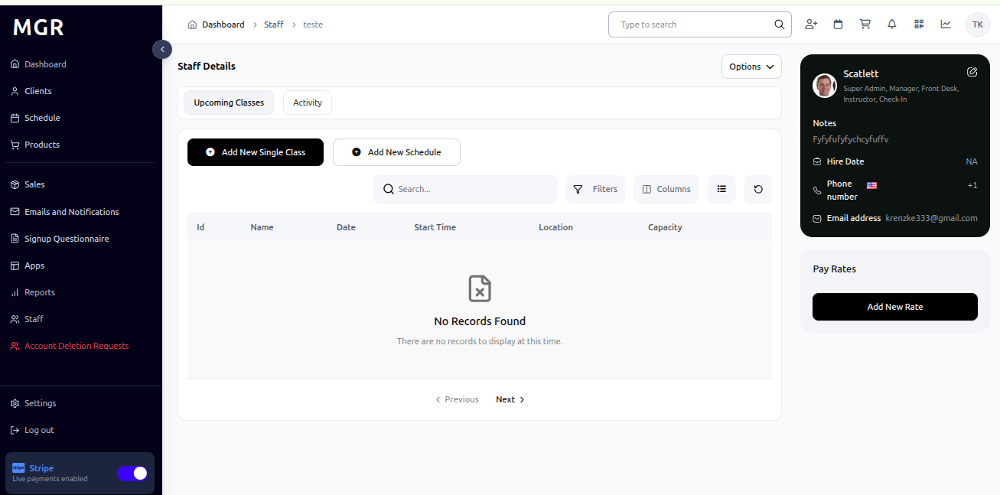
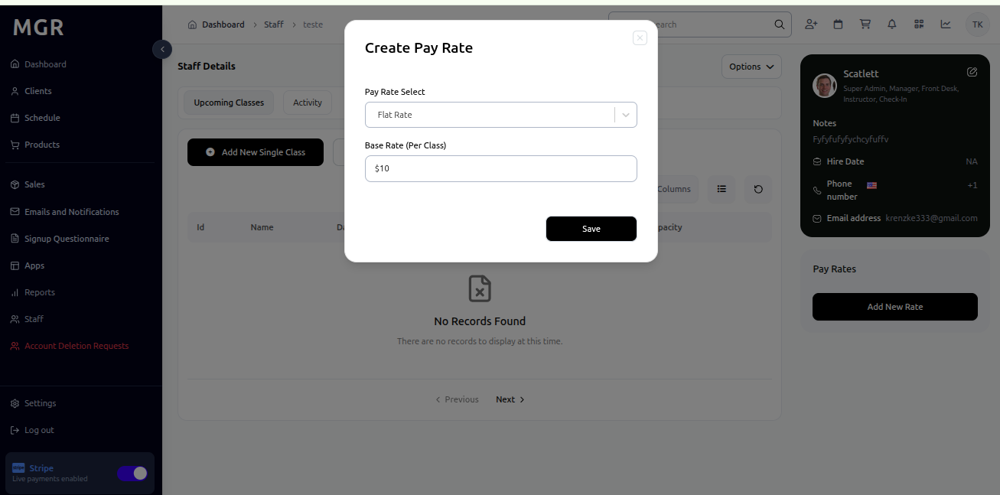

# Staff Pay Rates Management

Simple step-by-step instructions for managing staff pay rates in the admin dashboard.

## Steps to Manage Staff Pay Rates

### 1. Access Pay Rates Section

a. Navigate to **Dashboard → Staff**

b. Select a staff member

c. Find the "Pay Rate" section in the staff profile

d. Review existing pay rates and their effective dates

### 2. Add New Pay Rate

Click **"Add New Rate"** button in the Pay Rate section

### 3. Configure Rate Details

a. Select pay rate type from available options:
   - Flat Rate
   - Flat Rate (Bonus)
   - Per Client
   - Per Client (Bonus)

b. Add Base Rate (Per Class)

### 4. Review and Save

a. Verify all rate information is correct

b. Confirm effective dates and rate amounts

c. Click **"Save"** to finalize

## Pay Rate Types

**Flat Rate:** Fixed compensation amount regardless of duration
- Example: $50 for administrative tasks

**Flat Rate (Bonus):** Fixed compensation with bonus component
- Example: $50 base + $10 bonus for quality standards

**Per Client:** Compensation based on number of clients served
- Example: $25 per client for personal training

**Per Client (Bonus):** Client-based compensation with bonus structure
- Example: $25 per client + $5 retention bonus

**Base Rate (Per Class):** Fixed rate per class or session
- Example: $75 per yoga class

## Troubleshooting

**Common Issues:**
- **Rate Creation Errors:** Verify all required fields are completed
- **Effective Date Problems:** Check date format and future/past date validity
- **Permission Issues:** Ensure admin rights for pay rate management

**Need Help?** Contact system administrator or technical support.
